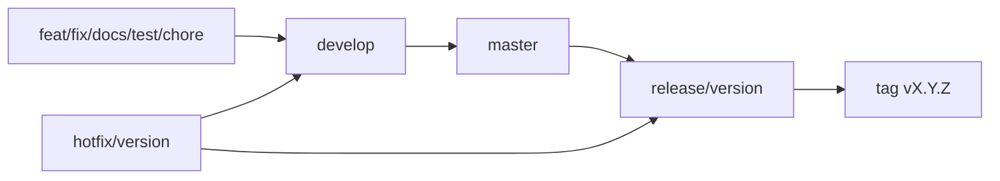
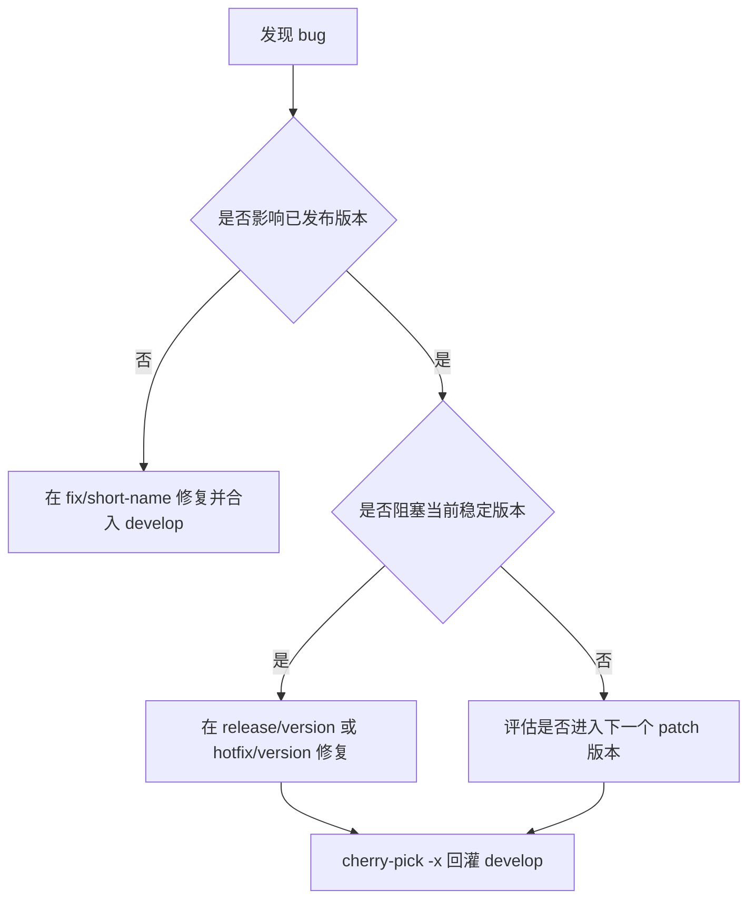

# 贡献指南

感谢你关注 UBS IO。这个项目面向 Ascend/NPU I/O 加速、KV Cache、BoostIO 缓存运行库和生态集成。我们欢迎代码、文档、测试、部署经验、性能数据和设计讨论。

## 贡献类型

- **Bug 修复**：修复构建、部署、运行、接口兼容或文档错误。
- **特性开发**：新增 KV、BoostIO、Mooncake/memcache/vLLM-Ascend 集成能力。
- **文档改进**：完善安装、配置、FAQ、示例、性能复现和问题排查。
- **测试与质量**：补充单元测试、集成测试、部署验证脚本和性能基线。
- **RFC 讨论**：讨论架构、公共 API、部署模型、性能路径或兼容策略的重大变化。

## 开始之前

1. 阅读 [README.md](README.md)、[ROADMAP.md](ROADMAP.md) 和相关子系统文档。
2. 搜索已有 Issue 和 PR，避免重复工作。
3. 对较大变更先创建 RFC Issue，等方向收敛后再提交实现。
4. 首次参与可以优先选择维护者标记为“适合新手”或“欢迎协助”的任务。

## 分支、合入与发布策略

### 分支职责

- `master`
  - 正式发布和版本 tag 的基线分支。
  - 只承接经过稳定窗口验证的发布代码，不接受普通 PR 直接合入。

- `develop`
  - 日常开发和下一个版本的集成分支。
  - 所有代码、文档、测试和构建脚本改动都应通过 PR、评审和基础验证后进入。

- 短生命周期工作分支
  - 建议从 `develop` 拉出，并在对应 PR 合入后删除。
  - 推荐命名：
    - `feat/<short-name>`
    - `fix/<short-name>`
    - `docs/<short-name>`
    - `test/<short-name>`
    - `chore/<short-name>`

- `release/<version>`
  - 从 `master` 或已确认的发布基线切出，用于稳定窗口和正式发布。
  - 切出后严格冻结，只允许 bugfix、文档、版本号、release notes、低风险配置变更。
  - 不允许继续合入未收敛特性；正式版本 tag 只打在稳定发布基线上。

- `hotfix/<version>`
  - 用于已发布版本的阻塞问题或高优先级修复。
  - 修复完成后先合入对应 `release/<version>` 或发布基线，再通过 `cherry-pick -x` 回灌 `develop`。

### 推荐流转



这张图对应两个原则：

- 新特性、文档和常规修复先进入 `develop`，不要直接堆到 `master` 或 `release/<version>`。
- 已发布版本的修复先落到稳定发布分支，再回灌 `develop`，避免同一个问题两边各修一遍。

### 特性合入原则

- 一个 PR 尽量只做一件事，避免把特性、重构、格式化和无关文档混在一起。
- 大特性应拆成多个可评审、可回归的小 PR；涉及架构、公共 API、部署模型或性能关键路径时先走 RFC。
- 未完成特性如需提前合入，必须具备 feature flag、配置开关或默认关闭路径。
- 到切 `release/<version>` 的时间点仍未收敛的特性，顺延到下一个版本，不阻塞当前发版。

原则：**未完成特性不应该阻塞发版。**

### bugfix 合入原则



原则：**同一个 bug 只写一次修复逻辑，通过 cherry-pick 回灌，避免分支间实现漂移。**

### 提交标题

提交标题建议使用以下前缀：
  - `feat:` 新功能
  - `fix:` 缺陷修复
  - `docs:` 文档
  - `test:` 测试
  - `refactor:` 重构
  - `perf:` 性能优化
  - `chore:` 构建、脚本、仓库维护

示例：

```text
docs: add BoostIO offline deployment FAQ
fix: handle missing UBSIO_CONFIG_PATH
feat: add Mooncake backend configuration guide
```

## Pull Request 要求

每个 PR 应尽量聚焦一个主题，并包含：

- 问题背景和变更摘要。
- 影响范围：`area/kv`、`area/boostio`、`area/docs` 等。
- 测试结果：写明执行过的命令和结果；无法执行时说明原因。
- 文档更新：用户可见行为、配置、接口或部署方式变化必须更新文档。
- 兼容性说明：公共 API、配置项、部署路径、产物结构变化需要明确标注。
- 关联 Issue 或 RFC。

## RFC 门槛

满足任一条件时，请先提交 RFC Issue：

- 改变架构、公共 API、配置项语义或部署模型。
- 改变性能关键路径，例如 KV Cache 读写、BoostIO 缓存策略。
- 引入新的外部依赖、服务进程、协议或持久化格式。
- 单个 PR 预计超过约 500 行非测试代码。
- 需要跨子系统协作，例如同时影响 `ubsio-kv` 和 `ubsio-boostio`。

RFC 应说明背景、目标、非目标、方案、兼容性、测试计划和替代方案。

## 代码与文档风格

- 遵循所在目录已有代码风格和构建方式。
- 保持接口边界清晰，避免在无关子系统中做顺手重构。
- 新增用户可见配置、脚本参数、部署步骤时同步更新文档。
- 文档示例命令应可复制执行；使用占位符时用 `<repo-url>`、`<device>`、`/path/to/...` 等明确格式。
- 中英文文档可以分阶段同步，但项目定位、快速开始和贡献入口必须保持一致。

## 测试建议

根据变更类型选择合适验证：

- 文档：检查链接、命令路径、标题结构和中英文一致性。
- 构建脚本：执行对应脚本的帮助、 dry-run 或最小构建路径。
- UBSIO-KV：当前可参考 [ubsio-kv](ubsio-kv/) 代码入口；独立安装与使用指南以后续版本文档为准。
- BoostIO：参考 [推理三级池化场景安装部署指南](docs/ubsio-boostio/推理三级池化场景安装部署指南.md)。
- Mooncake 集成：参考 [Mooncake patch 指南](patches/mooncake/mooncake.md)。

PR 描述中请粘贴实际执行命令和关键结果。

## 评审 SLA

- 新 Issue：维护者目标是在 2 个工作日内完成首次分拣。
- 新 PR：维护者目标是在 3 个工作日内给出首次反馈。
- RFC：维护者目标是在 5 个工作日内确认讨论负责人和下一步。
- 安全问题：按 [SECURITY.md](SECURITY.md) 的响应周期处理。

这些 SLA 是社区协作目标；如果遇到版本发布、假期或硬件资源限制，维护者会在 Issue 或 PR 中说明。

## 行为准则

请保持专业、尊重和面向事实的讨论。评审聚焦代码、设计、文档和可复现证据。对争议方案优先通过 RFC、最小实验和性能数据收敛。
