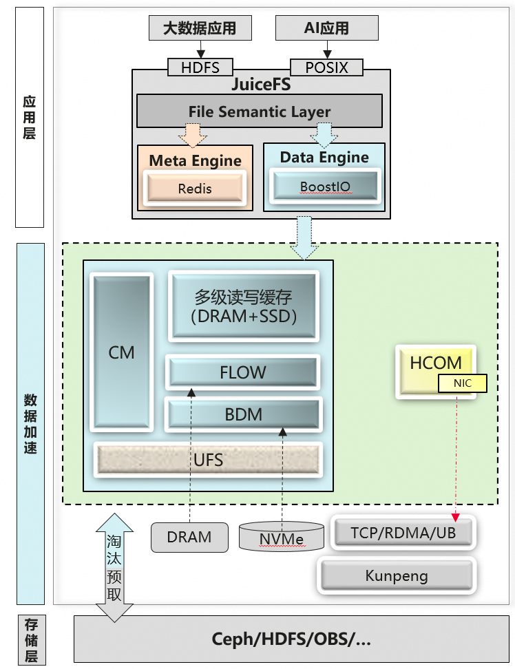
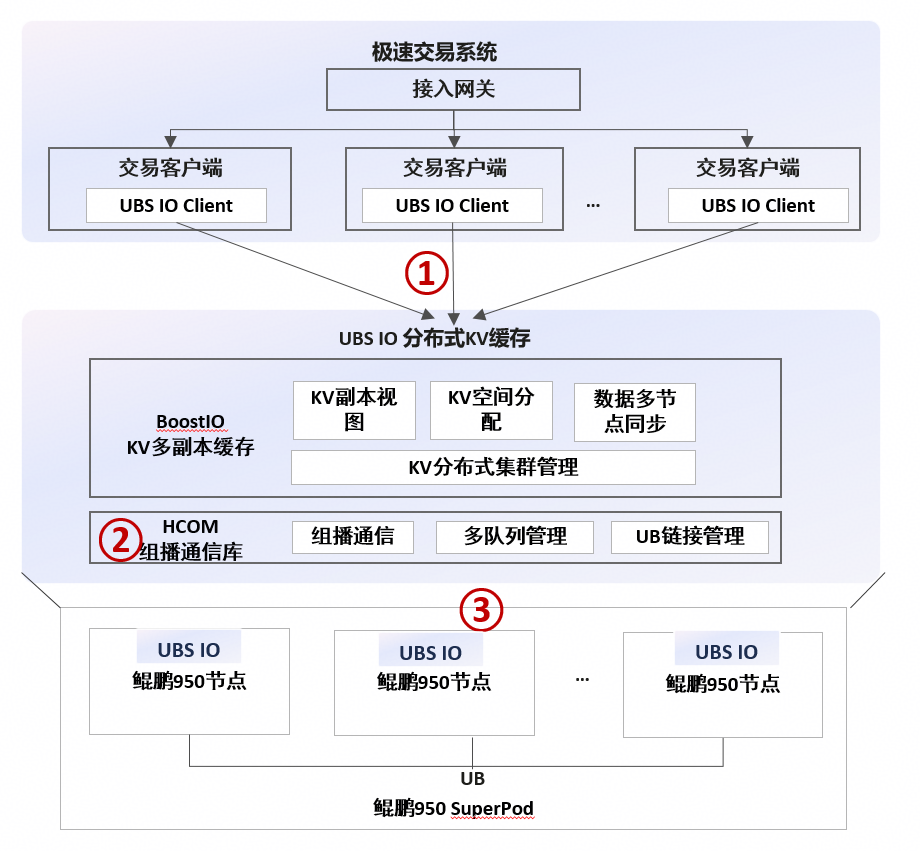

<div align="center">


<strong>面向高性能 I/O 与低时延内存 KV 场景的分布式缓存套件</strong>

[](LICENSE)

[English](README_EN.md) | [贡献指南](CONTRIBUTING.md) | [UBSIO-KV(release/1.2)](https://gitcode.com/openeuler/ubs-io/blob/release/1.2/README.md)

</div>

## 概述

UBS IO 是面向推理、大数据、AI 融合和低时延交易等场景的 I/O 加速套件。项目通过计算侧内存、NVMe SSD 和高速网络构建缓存与内存存储能力，缩短应用访问数据的路径，并为上层业务提供统一的 C 接口、集群管理和诊断工具。

项目包含两条相互独立、共享基础组件的数据路径：

- **UBSIO-BoostIO**：面向存算分离场景的分布式读写缓存，使用内存和 NVMe SSD 扩展计算侧缓存容量，并提供多副本、缓存淘汰、后端存储和可观测能力。
- **UBSIO-MemStore**：面向低时延业务的分布式内存 KV 存储，提供进程间共享内存访问、跨节点副本同步、数据变更通知和故障恢复能力。
- **UBSIO-KV**：位于 [`release/1.2`](https://gitcode.com/openeuler/ubs-io/blob/release/1.2/README.md)，面向上层应用提供统一的 KV Cache 接口层、C/Python 接口以及单条和批量 KV 操作，并将请求组织后转发到 UBSIO-BoostIO 缓存数据面。

## 核心能力

- **多级缓存**：通过内存与 NVMe SSD 组织读缓存、写缓存和流式数据空间。
- **低时延内存 KV**：提供单条及批量 Put、Get、Update、Replace、Delete 操作。
- **集群与副本管理**：基于节点视图和分区视图维护数据分布、服务状态和副本一致性。
- **多种通信路径**：支持节点内共享内存 IPC，以及节点间 RDMA/UB RPC 通信。
- **运维诊断**：UBSIO-Common 的 CLI 与 Trace 组件为 UBSIO-BoostIO 和 UBSIO-MemStore 提供诊断入口。

## 核心组件

| 组件                      | 主要职责 | 入口 |
|-------------------------| --- | --- |
| UBSIO-BoostIO           | 分布式读写缓存、Cache/Flow 管理、BDM 磁盘后端和 UnderFS 接入 | [用户指南](docs/ubsio-boostio/zh/boostio_user_guide.md) · [安装部署指南](docs/ubsio-boostio/zh/boostio_deployment_guide.md) · [API 参考](docs/ubsio-boostio/zh/boostio_api_reference.md) |
| UBSIO-MemStore          | 分布式内存 KV、共享内存索引、多副本同步、通知和 CRB 故障恢复 | [用户指南](docs/ubsio-memstore/zh/memstore_user_guide.md) · [API 参考](docs/ubsio-memstore/zh/memstore_api_reference.md) |
| UBSIO-KV                | 面向应用提供 C/Python KV Cache API，负责参数校验、Key 哈希和批量请求组织 | [查看 release/1.2 README](https://gitcode.com/openeuler/ubs-io/blob/release/1.2/README.md) · [API 参考](https://gitcode.com/openeuler/ubs-io/blob/release/1.2/docs/ubsio-kv/API接口列表.md) |
| UBSIO-Common            | UBSIO-BoostIO 和 UBSIO-MemStore 共用的 CLI 与 Trace 基础组件 | [源码目录](ubsio-common/) |

## 全景架构

### UBSIO-BoostIO

UBSIO-BoostIO 在计算侧通过内存、NVMe SSD 和后端存储构建分布式缓存数据路径。完整的模块职责和数据流说明请参见 [UBSIO-BoostIO 用户指南](docs/ubsio-boostio/zh/boostio_user_guide.md)。

<div align="center">

</div>

#### 系统优化

1. **I/O 缓存加速**：利用计算侧闲置的内存和磁盘资源构建分布式多级读写缓存，降低数据读写时延。
2. **端到端优化**：联合 JuiceFS 优化完整 I/O 路径，提供数据亲和、免拷贝和 FUSE 用户态劫持能力。
3. **流控优化**：采用缓存配额和令牌桶进行负载控制，并重构超时处理机制，显著提高应用任务并发度。
4. **多样化后端存储**：数据淘汰使用通用对象存储接口，可适配当前主流存储系统。
5. **多种缓存策略**：支持本地亲和与全局均衡、回写与透写模式，以及目录级缓存策略配置。
6. **RDMA/UB 加速**：通过 HCOM 通信组件使用 RDMA/UB 单边操作转发 I/O，保障高速数据传输。

#### 软件架构

##### 数据引擎

UBSIO-BoostIO 的数据引擎由多级读写缓存及其配套模块组成：

- **Cache**：分离式读写缓存框架，基于本地 DRAM 和 NVMe SSD 提供两级缓存，负责管理缓存数据，并支持配置不同的缓存策略和资源。
- **FLOW**：提供内存和磁盘上的线性数据空间及追加写能力，将随机 I/O 转换为顺序 I/O，提高磁盘访问性能。
- **BDM**：负责磁盘空间池化和磁盘读写，基于 `io_uring` 提供高性能异步 I/O，并支持后续演进至灵衢 SSU 池化服务器。
- **UFS**：负责后端大容量存储管理，支持对接 Ceph 和 HDFS，并支持扩展自定义后端存储。
- **HCOM**：提供统一的 IPC 和 RPC 消息传输能力，支持 TCP、RDMA 和 UB 通信协议。
- **CM**：基于开源 ZooKeeper 构建集群管理能力，通过多 Pool 模式支持超大规模集群。

##### 元数据引擎

使用 JuiceFS 支持的元数据引擎组件，当前配置使用 Redis。

##### JuiceFS

1. **数据 I/O 路径优化**：启用 UBSIO-BoostIO 缓存，替换 JuiceFS 原生的数据缓冲区和单机缓存功能。
2. **POSIX 接口劫持**：通过 `LD_PRELOAD` 劫持 POSIX 接口，绕过用户态 FUSE 开销，并提供端到端免拷贝能力。

### UBSIO-MemStore

UBSIO-MemStore 通过轻量级客户端、共享内存索引和内存管理进程提供节点内访问与跨节点副本同步。完整的模块职责和交互说明请参见 [UBSIO-MemStore 用户指南](docs/ubsio-memstore/zh/memstore_user_guide.md)。

<div align="center">

</div>

#### 技术效果

1. **KV 多副本内存缓存**：鲲鹏超节点 8 副本同步写时延约 10 μs（1 KB），读时延低于 1 μs，单节点吞吐超过 20 万次/秒。
2. **UB 组播可靠性与容错**：提供网络断联、读写失败等故障的自愈和容错能力，故障感知时延低于 1 秒，数据迁移恢复时间低于 2 分钟。

## 快速开始

构建 UBSIO-BoostIO：

```bash
cd ubsio-boostio
bash build.sh -t debug
```

构建 UBSIO-MemStore：

```bash
cd ubsio-memstore
bash build.sh -t debug
```

构建依赖、部署步骤和配置要求请以对应组件文档为准：

- [UBSIO-BoostIO 安装部署指南](docs/ubsio-boostio/zh/boostio_deployment_guide.md)
- [UBSIO-BoostIO 配置说明](docs/ubsio-boostio/zh/boostio_configuration_guide.md)
- [UBSIO-MemStore 安装部署指南](docs/ubsio-memstore/zh/memstore_deployment_guide.md)
- [UBSIO-MemStore 配置说明](docs/ubsio-memstore/zh/memstore_configuration_guide.md)

## UT

```bash
cd ubsio-boostio/test/llt
bash run_dt.sh
```

```bash
cd ubsio-memstore/test/llt
bash run_dt.sh
```

UT脚本会重新构建对应组件并生成覆盖率结果。运行前请准备文档要求的编译工具和三方依赖。

## 文档

所有组件级产品文档统一存放在顶层 [`docs/`](docs/) 目录：

- [`ubsio-boostio`](docs/ubsio-boostio/zh/)：UBSIO-BoostIO 用户、安装部署、配置、API、安全和版本文档。
- [`ubsio-memstore`](docs/ubsio-memstore/zh/)：UBSIO-MemStore 用户、安装部署、配置、API、性能和安全文档。

## 参与贡献

欢迎通过 Issue 和 Pull Request 反馈问题、提交修复或参与功能设计。提交前请阅读 [CONTRIBUTING.md](CONTRIBUTING.md)，保持修改主题聚焦，补充必要的测试和文档，并在 PR 中记录实际执行的验证命令。

## 许可证

UBS IO 源代码采用 [木兰宽松许可证第 2 版](LICENSE)，产品文档许可证请参见 [`docs/LICENSE`](docs/LICENSE)。

## 说明

此开源项目非华为产品，仅提供有限支持。
