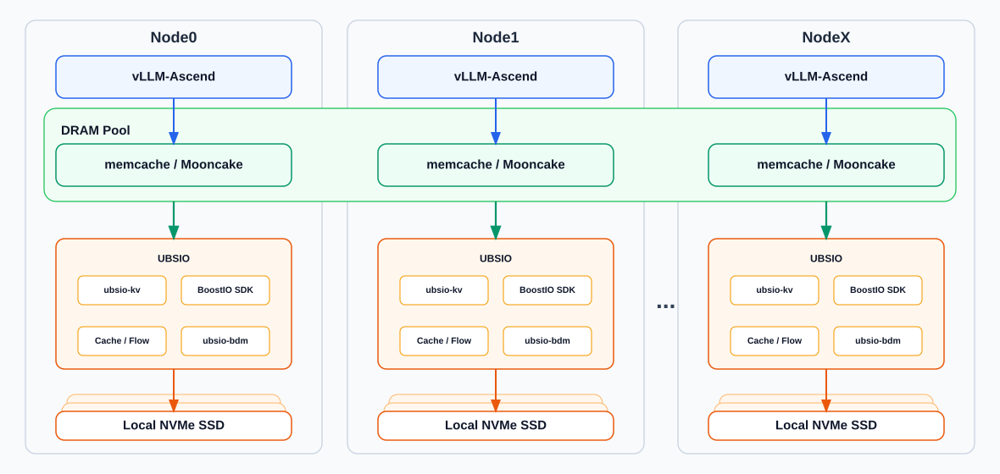

  
  

  <h2 align="center">
基于计算侧 SSD 的 L3 分布式 KV Cache 缓存系统
  </h2>

[English](README.en.md) | [贡献指南](CONTRIBUTING.md) | [路线图](ROADMAP.md) | [FAQ](FAQ.md) | [安全策略](SECURITY.md)

 

## 🔄Latest News

- [2026/06] UBS IO 完成 G2.5 特性合入，支持缓存读写和 SSD 可选化缓存
- [2026/06] UBS IO 基于计算侧 SSD 构建 L3 级分布式 KV Cache 缓存，支持对接 Mooncake 开源生态，使能 HBM+DRAM+SSD 三级缓存架构需求

## 🔜 Roadmap&发布策略

UBS IO roadmap 详见：[**Roadmap**](ROADMAP.md)

UBS IO 分支发布策略：[**分支发布策略**](CONTRIBUTING.md#分支合入与发布策略)

## 🎉概述

UBS IO 是面向 LLM 推理场景的 L3 分布式 KV Cache 缓存系统，聚焦 Agent 多轮交互、长序列请求和高复用率业务，通过计算侧 NVMe SSD 扩展 KV Cache 容量，提升历史 KV Cache 命中率并减少重复 Prefill 计算。

主要特性包括：

- **标准 KV Cache 访问**：覆盖初始化、退出、写入、读取、删除、存在性查询、长度查询，以及批量写入、批量读取、批量删除、批量查询等操作。
- **standalone 本地缓存运行时**：支持推理进程通过 SDK 拉起本地缓存 server，减少独立服务进程和额外网络依赖。
- **内存与 SSD 缓存空间**：支持本地内存与 NVMe SSD 组成缓存空间，提供 WCache/RCache、Flow 映射、缓存水位、读写比例、日志、Trace、CRC 和 QoS 等基础配置能力。
- **无盘/有盘部署形态**：支持无盘模式仅使用本地内存缓存，也支持通过 `ubsio.disk.path` 配置本地 SSD 作为 KV Cache 扩容层。
- **memcache 生态接入**：支持与 memcache 组合接入 vLLM-Ascend KV Cache 复用加载场景。
- **Mooncake 生态接入**：提供 Mooncake KV Backend patch，用于 Mooncake Store 接入 UBSIO 后端并对接 vLLM-Ascend 场景。

  

## 🧩核心组件

UBS IO 当前围绕单机推理 standalone 主路径组织核心组件：

- **UBSIO-KV**：
  - 面向上层应用提供标准 KV 调用接口，包括 `put`、`get`、`batch_put`、`batch_get`、`exist` 等常用操作。
  - KVC 层负责参数校验、key hash、location 计算和批量请求组织，将 KV Cache 语义转换为 `BioPut`、`BioStat`、`BioBatchGet` 等 BoostIO 对象操作。
  - 初始化阶段动态加载 `libbio_sdk.so`，并以 standalone 模式创建默认 cache，用于衔接 memcache、Mooncake 与后端缓存数据面。

- **Mooncake patch**：
  - 提供 Mooncake Store 后端集成 patch。
  - 用于 Mooncake KV Backend 接入 vLLM-Ascend 场景。
  - 使用说明：[Mooncake patch 指南](patches/mooncake/mooncake.md)

- **UBSIO-BoostIO**：
  - 提供 BoostIO SDK 与 standalone 本地缓存运行时，承接 UBSIO-KV 转发的对象读写、存在性检查和批量读取请求。
  - standalone 场景下通过 BioClient / MirrorClient / BioClientAgent 在推理进程内直调本地 BioServer / MirrorServer，当前主路径不依赖独立集群网络。
  - Cache / Flow 负责 WCache / RCache、slice 映射和缓存对象生命周期管理，协调内存与 SSD 层的数据流转。
  - 相关文档：[BoostIO README](ubsio-boostio/README.md)、[特性指南](docs/ubsio-boostio/UBS-IO%20特性指南.md)

- **UBSIO-BDM**：
  - 作为 BoostIO 的本地块设备后端，负责 NVMe SSD chunk 分配、元数据恢复、同步/异步磁盘 I/O 和磁盘状态管理。
  - 与 Flow / Cache 协同，把本机 SSD 空间组织为 KV Cache 的 L3 扩展容量。

## 🔥性能表现

UBS IO 的性能收益来自 KV Cache 层级容量扩展和本地访问路径收敛。它把主机侧 NVMe SSD 组织为 HBM / DRAM 之外的 L3 缓存空间，在 Agent 多轮交互、长序列请求和高复用率业务中保存更多可复用 token 数据，提高 KV Cache 命中率，减少重复 Prefill 计算，从而降低首 token 推理时延（TTFT）并提升推理吞吐（IPS）。当前重点关注：

- **更大的 KV Cache 有效容量**：通过 UBSIO-BDM 管理本机 NVMe SSD chunk，配合 Cache / Flow 将 SSD 纳入 KV Cache 对象生命周期。
- **更高的长序列复用命中率**：在高复用 Agent 场景下缓存更多历史 KV Cache 数据，降低因缓存容量不足导致的重复计算。
- **更短的本地主路径**：standalone 模式下通过 BioClientAgent 进行进程内直调，让 UBSIO-KV 到 BoostIO 数据面的主链路更集中。
- **更稳定的批量访问能力**：利用 BoostIO batch API、WCache / RCache 和 Flow 映射能力承接批量读取与存在性检查，支撑推理侧 KV Cache 复用加载。

后续性能基线计划见 [Roadmap](ROADMAP.md)。

## 🚀快速入门

- [安装使用](docs/ubsio-boostio/推理三级池化场景安装部署指南.md#部署库包)
- [配置文件](docs/ubsio-boostio/推理三级池化场景安装部署指南.md#配置文件)
- [样例执行](examples/ubsio-kv/README.md)

## 📑学习教程

- [ubsio-boostio API 接口列表说明](docs/ubsio-boostio/UBS-IO%20API参考.md)
- [ubsio-kv API 接口列表说明](docs/ubsio-kv/API接口列表.md)
- [ubsio-common(cli) 命令说明](docs/ubsio-common/CLI命令说明.md)

## 📦软件硬件配套说明

- UBS IO 本身不额外声明硬件强制依赖；如与 memcache、Mooncake 等外部组件组合使用，硬件、软件、驱动和版本配套要求以对应项目官方文档为准。

## 📌FAQ

常见问题请参考：[FAQ](FAQ.md)

## 🤝参与贡献

欢迎提交 Issue、PR 或参与设计讨论。为提高协作效率，请先阅读：

- [CONTRIBUTING.md](CONTRIBUTING.md)：贡献类型、分支模型、PR 要求、RFC 门槛和评审 SLA。
- [SECURITY.md](SECURITY.md)：安全漏洞报告和披露流程。

## 📝相关信息

- [三方依赖声明](THIRD_PARTY_NOTICES.md)
- [安全策略](SECURITY.md)
- [许可证](LICENSE)
