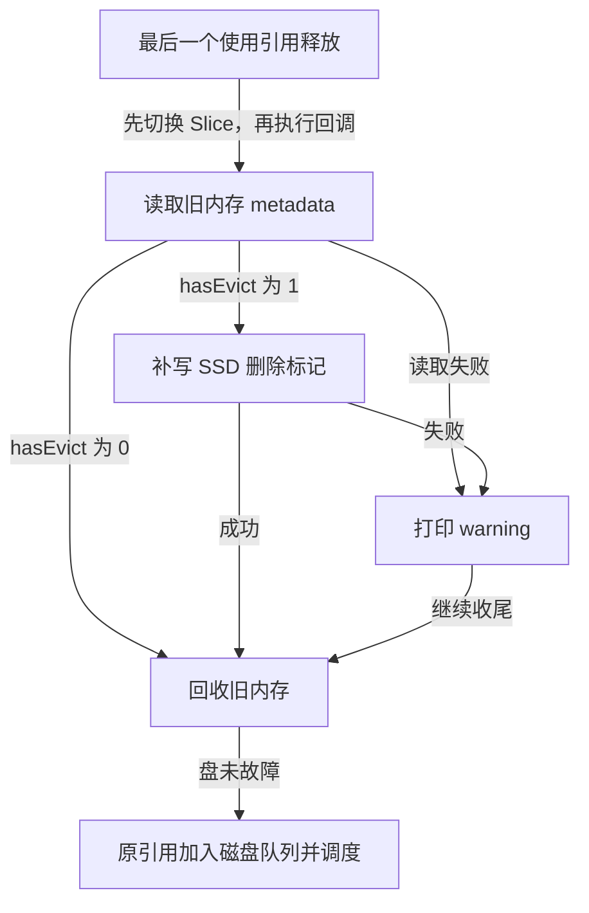

# WCache 内存发布与删除标记同步设计

本文记录 2026-09-21 讨论确认的修复方案及约束。范围是 Put 判重与 MEMORY → SSD 迁移中的失效标记；旧磁盘轮次隔离、恢复寻址预分配问题分别处理。

## 背景与决策

原流程先把新 Slice 加入淘汰队列，随后才调用 `WCacheIndex::Insert()`。重复副本可能先以 `hasEvict=0` 下刷，再被判重设为内存 `INVALID`，重启扫描因此可能恢复被拒绝的副本。

新流程采用内存完成即发布：内存 data、metadata 和 CRC 校验完成后，由 WCache 调用 Manager 注入的回调执行现有 `Insert()`。接口和重复 Put 的 `BIO_OK` 返回约定不变，不添加 inserted 出参，不引入索引占位/提交两阶段。

```text
检查写入策略 → 写内存 → Insert → INVALID 时设置内存 hasEvict=1
    → Slice 入队 → 异步调度或同步推进队头
```

`VALID` 分支保留初始化时的 `hasEvict=0`，不再次写回 0。`INVALID` 表示当前对象应失效，不需要区分重复拒绝与已被并发 Delete 删除。失效 metadata 处理完成前不得进入普通搬运；失败对象仍须通过 tombstone 路径回收其 Flow 区间。

发布后 Get/Exist 可以读取完整内存数据。同步下刷推进原有队头，不保证本次 Put 的 Slice 已到达 SSD/UnderFS。队头下刷失败不撤销当前已发布对象；错误返回不表示当前 key 一定不存在。

发布与入队前的失效标记修改受 Slice 操作锁保护。同步路径取出 INVALID 队头时同样走 tombstone 分支，不能把标记写入失败的对象按有效数据搬运。有 reader 的已删除内存对象通过 `SetSlice(nullptr)` 延后释放；UnderFS 队头写入失败时保留该对象并登记重试。

## 迁移完成回调

`SetSlice()` 在 reader 引用归零后先切换到 SSD Slice，再执行旧内存回收回调。Delete 通过相同的引用机制保护旧 Slice，因此回调读取旧内存 metadata 时，使用旧内存地址的 Delete 已完成。

回调在回收旧内存之前检查旧 metadata：若 `hasEvict=1`，将本次迁移目标的 SSD metadata 同步写为 1；若为 0，不回写 SSD。这样不会覆盖切换之后直接写到 SSD 的删除标记。同步与后台搬运都使用 Slice 操作锁，避免首次 metadata 拷贝与 Delete 并发。

删除标记采用尽力同步：回调读取旧 metadata 或补写 SSD 标记失败时，打印包含 flowId、Slice 序号和错误码的 warning，然后继续回收旧内存并将原引用加入磁盘队列。未发生删除时不回写 0，已标记故障盘时跳过补写和磁盘入队。首次 data/metadata 下刷失败仍保留原有错误返回与队头重试，CRC 校验不变。

盘未故障时的回调流程如下：



回调只捕获本次迁移的 SliceRef 和两份 metadata 地址，不创建持久的完成任务、阶段标志或失败链表，不为补写失败登记额外重试。仍由原有引用计数延迟回调和内存回收；回调可能在最后一个 reader 的 Release 线程执行。普通对象增加一次内存 metadata 检查，需要同步删除标记的对象才尝试 SSD metadata 写入。

移除的是同步 UnderFS 路径为等待索引发布而增加的 `deferred` 参数及分支。reader 引用导致的延迟 `SetSlice()` 仍保留，恢复等入口的 `PENDING` 防护仍返回普通重试。

## 持久化与兼容性边界

- **Delete 返回成功不承诺立即崩溃后的重启安全性。** reader 尚未退出或迁移回调尚未补写时，SSD 删除标记可能仍未更新。
- **补写失败允许留下过期的 SSD 有效标记，后续恢复可能重新出现已删除记录。** 这是本分支针对 vLLM 缓存场景明确接受的容错边界，不保证失败后最终补写成功。实现位于共用 WCache 迁移路径，没有新增模式开关，其他使用该路径的调用方也遵循此语义。
- 公共 C/Python API、配置、磁盘 metadata 布局及 `hasEvict` 的 0/1 含义保持不变；成功 Put 仍不等价于当前 Slice 的 SSD 持久化。
- 不改为覆盖式 Put，不为重复副本发送 key 级 DELETE 通知。
- 不自动修复无法辨别来源的历史错误磁盘记录；第二、第三项根因不属于此修改。
- 不将磁盘 I/O 放入 Index 桶锁，不等待整个 Flow 的 Put 完成。

## 验证范围

补充测试源码覆盖发布早于入队、重复/并发删除后的 metadata、队头失败保留当前索引、reader 延迟迁移、标记读取/补写失败后继续回收且不登记重试、SSD 删除标记不回退及故障清理。按仓库约定默认只编译和静态检查，不执行 UT/LLT；真实 SSD 重启、掉电及压力测试需要另行授权和独立环境。
