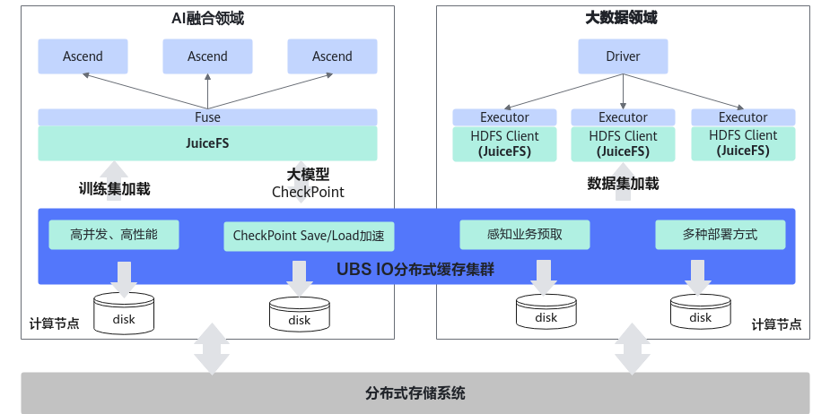
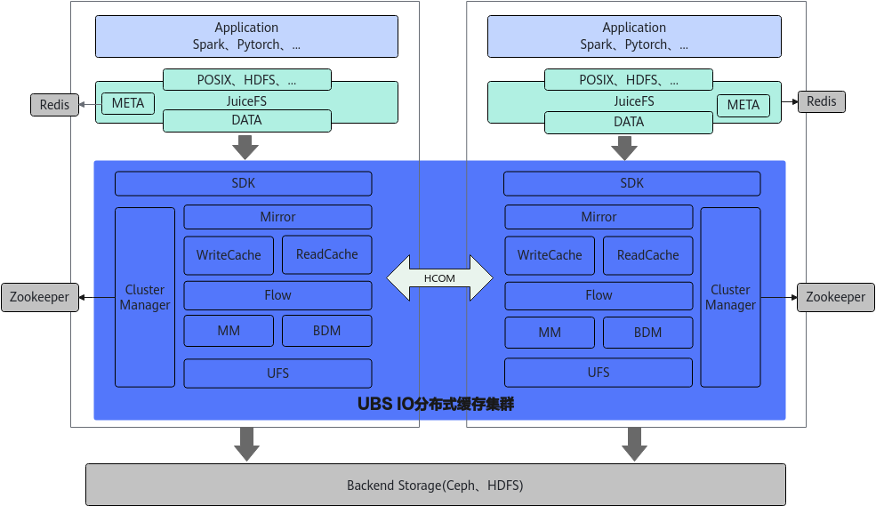
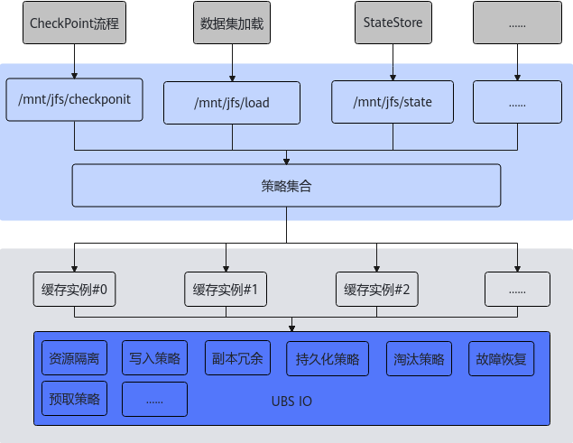
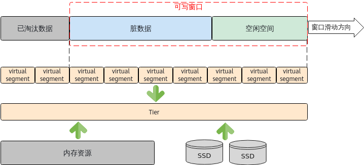
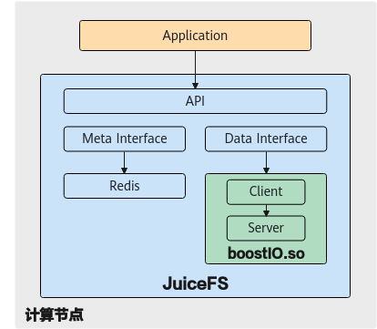
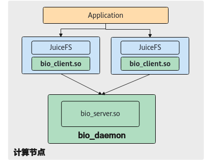
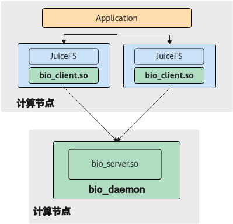

# UBSIO-BoostIO 用户指南

## 特性描述

### 概述

本文档介绍 UBSIO-BoostIO 的关键特性、整体软件架构、应用场景和部署方式，并说明可靠性规格、故障处理及后端存储使用要求。

安装部署和配置操作请分别参见[安装部署指南](boostio_deployment_guide.md)和[配置说明](boostio_configuration_guide.md)。

### 应用场景

随着互联网大数据应用、云原生业务和AI融合应用的快速发展与落地，数据规格呈爆发式增长。在此背景下，传统的存算一体架构面临横向扩展困难、资源利用率低等问题，尤其在云化趋势下数据资源共享度变低，进一步限制了系统整体性能。

因此存算分离架构成为未来数据基础设施发展主流。然而存算分离架构也带来新的挑战：计算节点需跨网络访问远端存储，导致应用I/O延迟显著增加；同时大规模分布式计算节点的部署，容易造成计算资源利用率降低。

为应用上述问题，UBS IO基于华为鲲鹏计算平台，构建了一套高性能、高可靠的分布式读写缓存体系，并深度融合开源项目JuiceFS的广泛生态和优秀的北向兼容能力，有效缓解存算分离架构下的性能损耗。UBS IO通过以下方式突破性能瓶颈：

- 多级分布式写存储，降低写时延

  UBS IO基于计算侧的内存介质和高速磁盘构建多级分布式写缓存，结合RDMA高速网络和多副本冗余机制保证数据高可靠，让应用IO集中在计算侧缓存，从而降低数据写时延。

- 读写缓存独立架构，提升资源灵活性

  UBS IO创新性地采用读写缓存独立架构设计，可以带来缓存资源独立配置、淘汰策略灵活配置、资源使用互不影响等优势。

- 智能预取和冷热识别，提升缓存命中率

  UBS IO采用分布式读缓存叠加数据智能预取和冷热识别，可以保证热、温数据尽可能缓存在计算侧的内存和高速磁盘介质上，冷数据存储在后端大容量存储集群中，其目的是提高缓存命中率，降低应用数据读取时延。

UBS IO通过在计算侧构建高性能、智能化的分布式缓存体系，精准应对存在分离架构下的关键挑战，可以很好的解决大数据领域和AI融合领域的性能瓶颈问题，提升端到端应用性能表现。

**图1 场景说明**

### 整体架构

**图1 UBS IO整体架构设计**

上述架构模型视图中的逻辑元素如[表1 逻辑元素](#逻辑元素)描述所示。

**表1 逻辑元素**
<table style="undefined;table-layout: fixed; width: 879px"><colgroup>
<col style="width: 145px">
<col style="width: 148px">
<col style="width: 586px">
</colgroup>
<thead>
  <tr>
    <th>模块名中文名</th>
    <th>模块英文名</th>
    <th>详细描述</th>
  </tr></thead>
<tbody>
  <tr>
    <td>缓存客户端</td>
    <td>SDK</td>
    <td>提供C版本的对外API，UBS IO分布式缓存访问入口，负责实例管理、网络资源管理、节点/分区视图管理和流量控制等功能。</td>
  </tr>
  <tr>
    <td>数据镜像模块</td>
    <td>Mirror</td>
    <td>负责数据多副本冗余管理，缓存对象请求分发等功能。</td>
  </tr>
  <tr>
    <td>写缓存模块</td>
    <td>WriteCache</td>
    <td>负责写缓存对象数据、索引元数据和淘汰策略的管理功能，提供数据回写和透写模式。</td>
  </tr>
  <tr>
    <td>读缓存模块</td>
    <td>ReadCache</td>
    <td>负责读缓存对象数据、索引元数据和淘汰策略的管理功能，提供对象数据预取功能。</td>
  </tr>
  <tr>
    <td>流式空间模块</td>
    <td>Flow</td>
    <td>提供无限长的逻辑线性空间的申请和释放接口，支持数据Append方式写入。</td>
  </tr>
  <tr>
    <td>内存空间管理模块</td>
    <td>MM</td>
    <td>负责用于缓存的内存空间按照Block粒度进行管理，支持内存注册到RDMA和Shared Memory。</td>
  </tr>
  <tr>
    <td>磁盘块设备管理模块</td>
    <td>BDM</td>
    <td>负责用于缓存的磁盘块设备空间按照Block粒度进行管理，提供同步/异步数据读写功能。</td>
  </tr>
  <tr>
    <td>后端存储管理模块</td>
    <td>UFS</td>
    <td>管理多种后端存储系统，对上提供统一的数据访问接口，屏蔽后端存储系统差异。</td>
  </tr>
  <tr>
    <td>集群管理模块</td>
    <td>CM</td>
    <td>基于开源ZooKeeper提供缓存集群管理功能，负责状态监控、分区视图计算和故障处理等功能。</td>
  </tr>
</tbody></table>

### 关键技术

UBS IO作为计算侧分布式缓存层，架构方案设计上既要考虑业务性能目标，也要考虑缓存数据可靠性、集群可扩展性等高可用指标，因此UBS IO采用分区视图方案发挥其集群分布式系统能力。

### 分区视图技术方案

UBS IO作为计算侧分布式缓存层，架构方案设计上既要考虑业务性能目标，也要考虑缓存数据可靠性、集群可扩展性等高可用指标，因此UBS IO采用分区视图方案发挥其集群分布式系统能力。

- 分区视图主要作用
    - 副本管理：分区会关联到副本信息，当前版本支持双副本冗余，每个副本又会关联两级缓存介质，分别为内存和磁盘。
    - 数据均衡：缓存客户端根据分区视图和负载均衡算法，将业务下发的请求分发到集群中各个节点上去执行，可以实现每个节点的业务负载、缓存资源利用率是均衡的，避免出现单点瓶颈问题。
    - 线性扩展：通过分区视图重计算/变更可以做到节点扩容后能够接近线性地扩展性能。
    - 故障处理：分区视图能够标记各个节点上的缓存状态。根据缓存状态做出相应的故障容错处理，保证业务连续性。

- 分区视图设计原理
    - 分区数量在集群初始化时读取配置项后就固定不变，解决扩容、节点/进程永久故障场景下导致的全局均衡策略失效。
    - 分区副本信息在集群启动后根据集群节点视图、汇总的每个节点的磁盘信息，再叠加负载均衡算法就生成了初始的分区视图，确保每个节点或每块磁盘都承载均匀的分区数量。
    - 永久故障和扩容场景都会导致分区视图重计算，重计算方法需要遵循数据可靠性原则、数据最小迁移原则和负载均衡原则。

### 缓存策略技术方案

不同的应用模型、同一应用不同的业务流程对于数据读写的性能要求都不尽相同，传统的分布式文件系统虽然支持通过参数配置来提供多种策略满足不同的业务需求，但是随着虚拟化、云原生应用的不断发展，对于分布式文件系统支持定制化的需求也不断高涨。

UBS IO采用多实例和软隔离技术支持文件/目录粒度的缓存策略个性化配置，对外提供数据写入策略、数据冗余度、缓存资源、数据持久化策略等参数配置来满足多样化的业务场景，有效提升了端到端整体应用性能。

**图1 缓存策略可配置**

### 数据管理技术方案

为了追求应用数据在不同I/O粒度、随机I/O模型和磁盘读写下的高性能，UBS IO创新性地在缓存层的多级数据布局上采用流式/线性数据存储方式，主要解决不同I/O大小带来的缓存空间浪费问题，同时减少随机I/O带来的频繁磁盘寻址导致的写入时延增大等性能瓶颈问题。

流式数据管理方案的核心思想是提供一个逻辑地址无限大的线性空间，当数据写入的时候首先从线性空间中向后递增地分配写入偏移，然后以append形式将数据追加写入到线性空间中。当前流式数据管理支持使用内存和NVMe SSD磁盘介质作为缓存空间。

**图1 流式数据管理**  

### 部署方式

大数据应用和智算AI应用在不同的场景下具有较大的部署和组网差异，并且结合现网中的集群部署方式，对软件在安装部署方面提出了更高的要求。

UBS IO分布式缓存层整体设计采用C/S架构，对外提供灵活多样的安装部署方式，其部署方式可以大致分为节点裸机部署和容器/虚拟机部署两类，每类又可细分为融合部署、分离部署和独立部署三种，此处以节点裸机部署为例详细介绍三种部署方式。

**图1 融合部署**

**图2 分离部署**

**图3 独立部署** 

### 约束限制

使用UBS IO作为计算侧缓存加速存在以下约束限制，请在使用过程中注意：

- 仅支持在华为鲲鹏计算平台上运行。
- 仅支持软件离线升级，不支持在线升级。
- UBS IO集群规模的规格为\[2,256\]，即支持最小配置两个计算节点，最大配置256个计算节点。
- UBS IO的缓存介质规格为内存加NVMe SSD磁盘，即单个计算节点需要配置内存和NVMe SSD磁盘给UBS IO作为数据缓存介质空间。
- UBS IO的缓存资源大小规格为内存资源大小满足大于或等于50GB，磁盘资源大小满足至少配置一块NVMe SSD，且磁盘容量为大于或等于3.6TB。
- UBS IO的后端存储系统规格为支持Ceph和HDFS这两种后端存储系统。
- UBS IO在安装部署过程中需要用户在执行节点上配置安装账户，由用户保证该账户的安全性。
- UBS IO POSIX桥接加速库限制在研发内部调试应用极限性能使用，由于桥接的接口不完备和安全条件不满足而不具备商用条件。

## 故障处理

分离部署模式下缓存客户端以二进制库的形式加载到应用进程中，应用进程退出会导致缓存客户端跟随退出，因此需要处理缓存客户端退出的故障模式。

分离部署模式下UBS IO存在独立缓存进程，融合部署模式下UBS IO和JuiceFS加载到同一个进程，该进程主要负责缓存客户端的请求处理，数据读写缓存和资源管理等业务处理，因此需要处理缓存进程故障的故障模式。

UBS IO要求部署在计算节点上，对外提供分布式读写缓存服务，因此需要处理部署UBS IO的计算节点故障的故障模式。

缓存客户端给服务端发送请求，缓存服务端之间消息交互等场景都会使用网卡进行通信，当网卡遭遇故障时会导致通信消息失败，比如请求消息发送失败，无法接收到响应等情况发生，因此需要处理通信网卡故障的故障模式。

UBS IO分布式缓存层依赖后端存储系统作为大容量数据持久化存储池，因此需要处理后端存储系统异常故障模式。

### 可靠性总体规格

使用者需要遵循当前UBS IO版本的可靠性规格，超过规格范围外的故障场景存在业务中断或数据丢失风险。

UBS IO支持的可靠性总体原则：

- 依赖的开源软件ZooKeeper、JuiceFS和Ceph不属于UBS IO可靠性范围内，不支持依赖软件故障或异常的容错处理。
- 当前版本仅支持单重故障，不支持多重故障叠加。
- 当前版本仅支持双副本冗余，同时故障两个副本会导致用户数据丢失。
- 故障节点的数据可靠性不保证。

### 缓存客户端故障/恢复

分离部署模式下缓存客户端以二进制库的形式加载到应用进程中，应用进程退出会导致缓存客户端跟随退出，因此需要处理缓存客户端退出的故障模式。

**表 1 缓存客户端故障模式** 

<table style="undefined;table-layout: fixed; width: 1021px"><colgroup>
<col style="width: 120px">
<col style="width: 236px">
<col style="width: 483px">
<col style="width: 121px">
</colgroup>
<thead>
  <tr>
    <th>场景</th>
    <th>影响</th>
    <th>处理方式</th>
    <th>限制</th>
  </tr></thead>
<tbody>
  <tr>
    <td>缓存客户端故障</td>
    <td> 写资源配额泄漏。 分发的请求响应失败。 通信链路断开。 创建的线性空间失效。</td>
    <td> 缓存服务端通过链路断开事件感知客户端退出，回收写资源配额，封存线性空间并将数据淘汰到后端存储。 删除失效的链路信息。</td>
    <td>无。</td>
  </tr>
  <tr>
    <td>缓存客户端恢复</td>
    <td> 重新建立通信链路。 缓存客户端重新执行初始化和上电流程。</td>
    <td>缓存服务端处理建链请求。</td>
    <td>无。</td>
  </tr>
</tbody>
</table>

### UBS IO进程故障/恢复

分离部署模式下UBS IO存在独立缓存进程，融合部署模式下UBS IO和JuiceFS加载到同一个进程，该进程主要负责缓存客户端的请求处理，数据读写缓存和资源管理等业务处理，因此需要处理缓存进程故障的故障模式。

**表 1  缓存进程故障模式** 

<table style="undefined;table-layout: fixed; width: 1110px"><colgroup>
<col style="width: 121px">
<col style="width: 236px">
<col style="width: 483px">
<col style="width: 270px">
</colgroup>
<thead>
  <tr>
    <th>场景</th>
    <th>影响</th>
    <th>处理方式</th>
    <th>限制</th>
  </tr></thead>
<tbody>
  <tr>
    <td>缓存进程故障</td>
    <td> 写缓存的副本数据丢失。 读缓存的对象数据丢失。 SDK端请求分发失败。</td>
    <td> 通过ZooKeeper心跳感知到缓存进程故障，通知集群管理更新视图，发布更新后的视图。 受进程故障影响的分区数据强制淘汰到后端存储。</td>
    <td> 缓存进程临时故障仅修改分区视图。 缓存进程永久故障，集群管理会将该节点移除集群，变更节点视图和分区视图。 临时故障时间窗口期可配置。</td>
  </tr>
  <tr>
    <td>缓存进程恢复</td>
    <td>读写缓存功能恢复。</td>
    <td> 临时故障恢复：通过ZooKeeper心跳感知到缓存进程恢复，通知集群管理更新视图，视图更新后再发布新视图。 永久故障恢复：执行扩容流程，请求重新加入集群。</td>
    <td>无。</td>
  </tr>
</tbody>
</table>

### 缓存节点故障/恢复

UBS IO要求部署在计算节点上，对外提供分布式读写缓存服务，因此需要处理部署UBS IO的计算节点故障的故障模式。

**表 1  缓存节点故障模式** 

<table style="undefined;table-layout: fixed; width: 1110px"><colgroup>
<col style="width: 121px">
<col style="width: 236px">
<col style="width: 483px">
<col style="width: 270px">
</colgroup>
<thead>
  <tr>
    <th>场景</th>
    <th>影响</th>
    <th>处理方式</th>
    <th>限制</th>
  </tr></thead>
<tbody>
  <tr>
    <td>缓存节点故障</td>
    <td> 写缓存的副本数据丢失。 读缓存的对象数据丢失。 SDK端请求分发失败。</td>
    <td> 通过ZooKeeper心跳感知到缓存进程故障，通知集群管理更新视图，发布更新后的视图。 受进程故障影响的分区数据强制淘汰到后端存储。</td>
    <td> 缓存节点临时故障仅修改节点视图和分区视图的状态。 缓存节点永久故障，集群管理会将该节点移除集群，变更节点视图和分区视图。 临时故障时间窗口期可配置。</td>
  </tr>
  <tr>
    <td>缓存节点恢复</td>
    <td>读写缓存功能恢复。</td>
    <td> 临时故障恢复：通过ZooKeeper心跳感知到缓存进程恢复，通知集群管理更新视图，视图更新后再发布新视图。 永久故障恢复：执行扩容流程，请求重新加入集群。</td>
    <td>无。</td>
  </tr>
</tbody>
</table>

### UBS IO通信故障/恢复

缓存客户端给服务端发送请求，缓存服务端之间消息交互等场景都会使用网卡进行通信，当网卡遭遇故障时会导致通信消息失败，比如请求消息发送失败，无法接收到响应等情况发生，因此需要处理通信网卡故障的故障模式。

**表 1  通信网卡故障模式** 

<table style="undefined;table-layout: fixed; width: 1044px"><colgroup>
<col style="width: 151px">
<col style="width: 242px">
<col style="width: 227px">
<col style="width: 424px">
</colgroup>
<thead>
  <tr>
    <th>场景</th>
    <th>影响</th>
    <th>处理方式</th>
    <th>限制</th>
  </tr></thead>
<tbody>
  <tr>
    <td>通信网卡故障</td>
    <td> SDK端请求发送失败。 SDK端请求接收超时。 分区视图接收失败。</td>
    <td> 通过ZooKeeper心跳感知到通信网卡故障，通知集群管理更新视图，视图更新后再发布新视图。 受网卡故障影响的分区数据强制淘汰到后端存储。</td>
    <td> 支持端口被占用、防火墙和网卡DOWN故障场景。 不支持网络丢包、网络错包、网卡单通和链路闪断等网卡异常场景。</td>
  </tr>
  <tr>
    <td>通信网卡恢复</td>
    <td> 请求发送功能恢复。 读写缓存各个流程支持重入。</td>
    <td>通过ZooKeeper心跳感知到通信网卡恢复，通知集群管理更新视图，视图更新后再发布新视图。</td>
    <td>无。</td>
  </tr>
</tbody>
</table>

### 后端存储系统异常

UBS IO分布式缓存层依赖后端存储系统作为大容量数据持久化存储池，因此需要处理后端存储系统异常故障模式。

**表 1  后端存储系统故障模式** 

<table style="undefined;table-layout: fixed; width: 1044px"><colgroup>
<col style="width: 151px">
<col style="width: 242px">
<col style="width: 227px">
<col style="width: 424px">
</colgroup>
<thead>
  <tr>
    <th>场景</th>
    <th>影响</th>
    <th>处理方式</th>
    <th>限制</th>
  </tr></thead>
<tbody>
  <tr>
    <td>后端存储系统故障</td>
    <td> 写缓存的对象数据无法淘汰。 读缓存预取加载对象数据失败。</td>
    <td>感知后端存储系统故障并作出相应告警，当前告警方式为日志打印。</td>
    <td>无。</td>
  </tr>
  <tr>
    <td>后端存储系统恢复</td>
    <td> 写缓存淘汰功能恢复正常。 读缓存预取加载功能恢复正常。 前台业务恢复正常。</td>
    <td>感知后端存储系统恢复并重连成功。</td>
    <td> 写缓存淘汰功能恢复，由于后端存储性能限制，恢复到正常水位需要一段时间。 写缓存淘汰性能限制，前台业务性能需要一段时间逐步恢复为正常水平。</td>
  </tr>
</tbody>
</table>

### 缓存磁盘故障

UBS IO分布式缓存层使用缓存磁盘NVMe SSD作为二级缓存介质，用于持久化读写缓存数据，需要有效应对缓存磁盘故障。

**表 1  缓存磁盘故障模式** 

<table style="undefined;table-layout: fixed; width: 1044px"><colgroup>
<col style="width: 151px">
<col style="width: 242px">
<col style="width: 227px">
<col style="width: 424px">
</colgroup>
<thead>
  <tr>
    <th>场景</th>
    <th>影响</th>
    <th>处理方式</th>
    <th>限制</th>
  </tr></thead>
<tbody>
  <tr>
    <td>新磁盘加入</td>
    <td>接入新盘过程中，前台I/O性能下降，业务受影响的时间不超过60s。</td>
    <td>新磁盘加入和识别、配置文件更新、加盘事件上报、触发视图重均衡、淘汰缓存数据和创建新缓存。</td>
    <td> 单次支持加1块盘，单节点可用盘最大支持4块盘，否则报错。 新加入磁盘容量大小规格，与集群磁盘规格保持一致。</td>
  </tr>
  <tr>
    <td>故障磁盘剔除</td>
    <td>故障检测与剔除期间，前台I/O性能下降，业务影响的时间不超过60s。</td>
    <td>上报磁盘故障到集群管理、完成受影响分区数据淘汰后上报处理、触发分区视图重计算与发布（期间故障分区IO自动重试）。</td>
    <td> 仅支持单盘故障，同时双盘故障会导致丢数据。</td>
  </tr>
</tbody>
</table>

### 缓存节点扩容

- 当前版本支持的集群规模最小为2节点，最大为256节点。因此最大扩容至集群256个节点。
- 支持同时批量进行扩容的缓存节点数为32个。
- 不支持故障处理期间进行缓存节点扩容操作。

## 后端存储使用说明

UBS IO会使用后端存储系统作为数据的持久化容量层。当前仅支持Ceph和HDFS分布式存储系统，后端存储系统由用户提供并创建UBS IO使用的存储池或挂载目录。因为后端存储系统属于用户管理和维护范围，需要用户保证提供给UBS IO使用的存储池或挂载目录不会被其它软件应用使用和访问，否则会破坏应用数据和构成目录越权风险。

## 版权说明

Copyright \(c\) Huawei Technologies Co., Ltd. 2026. All rights reserved.
