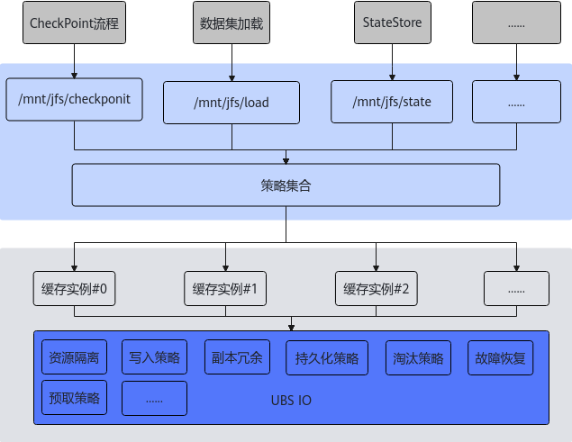
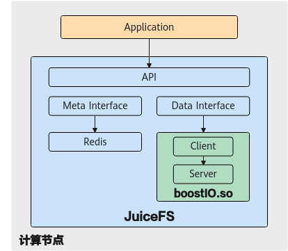
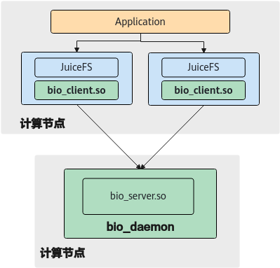

# 用户指南

## 特性描述

### 概述

本文档主要介绍IO加速套件UBS IO的关键特性，旨在帮助特性使用者快速了解UBS IO的整体软件架构和应用场景，熟练掌握其软件的安装部署方法，清楚软件可靠性规格。

UBS IO特性指南主要内容归纳总结如下：

- 软件整体架构
- 使能应用场景
- 安装部署指导
- 可靠性规格

### 应用场景

随着互联网大数据应用、云原生业务和AI融合应用的快速发展与落地，数据规格呈爆发式增长。在此背景下，传统的存算一体架构面临横向扩展困难、资源利用率低等问题，尤其在云化趋势下数据资源共享度变低，进一步限制了系统整体性能。

因此存算分离架构成为未来数据基础设施发展主流。然而存算分离架构也带来新的挑战：计算节点需跨网络访问远端存储，导致应用I/O延迟显著增加；同时大规模分布式计算节点的部署，容易造成计算资源利用率降低。

为应用上述问题，UBS IO基于华为鲲鹏计算平台，构建了一套高性能、高可靠的分布式读写缓存体系，并深度融合开源项目JuiceFS的广泛生态和优秀的北向兼容能力，有效缓解存算分离架构下的性能损耗。UBS IO通过以下方式突破性能瓶颈：

- 多级分布式写存储，降低写时延

  UBS IO基于计算侧的内存介质和高速磁盘构建多级分布式写缓存，结合RDMA高速网络和多副本冗余机制保证数据高可靠，让应用IO集中在计算侧缓存，从而降低数据写时延。

- 读写缓存独立架构，提升资源灵活性

  UBS IO创新性地采用读写缓存独立架构设计，可以带来缓存资源独立配置、淘汰策略灵活配置、资源使用互不影响等优势。

- 智能预取和冷热识别，提升缓存命中率

  UBS IO采用分布式读缓存叠加数据智能预取和冷热识别，可以保证热、温数据尽可能缓存在计算侧的内存和高速磁盘介质上，冷数据存储在后端大容量存储集群中，其目的是提高缓存命中率，降低应用数据读取时延。

UBS IO通过在计算侧构建高性能、智能化的分布式缓存体系，精准应对存在分离架构下的关键挑战，可以很好的解决大数据领域和AI融合领域的性能瓶颈问题，提升端到端应用性能表现。

**图1 场景说明**


### 整体架构

**图1 UBS IO整体架构设计**


上述架构模型视图中的逻辑元素如[表1 逻辑元素](#逻辑元素)描述所示。

**表1 逻辑元素**<a id="逻辑元素"></a>
<table style="undefined;table-layout: fixed; width: 879px"><colgroup>
<col style="width: 145px">
<col style="width: 148px">
<col style="width: 586px">
</colgroup>
<thead>
  <tr>
    <th>模块名中文名</th>
    <th>模块英文名</th>
    <th>详细描述</th>
  </tr></thead>
<tbody>
  <tr>
    <td>缓存客户端</td>
    <td>SDK</td>
    <td>提供C版本的对外API，UBS IO分布式缓存访问入口，负责实例管理、网络资源管理、节点/分区视图管理和流量控制等功能。</td>
  </tr>
  <tr>
    <td>数据镜像模块</td>
    <td>Mirror</td>
    <td>负责数据多副本冗余管理，缓存对象请求分发等功能。</td>
  </tr>
  <tr>
    <td>写缓存模块</td>
    <td>WriteCache</td>
    <td>负责写缓存对象数据、索引元数据和淘汰策略的管理功能，提供数据回写和透写模式。</td>
  </tr>
  <tr>
    <td>读缓存模块</td>
    <td>ReadCache</td>
    <td>负责读缓存对象数据、索引元数据和淘汰策略的管理功能，提供对象数据预取功能。</td>
  </tr>
  <tr>
    <td>流式空间模块</td>
    <td>Flow</td>
    <td>提供无限长的逻辑线性空间的申请和释放接口，支持数据Append方式写入。</td>
  </tr>
  <tr>
    <td>内存空间管理模块</td>
    <td>MM</td>
    <td>负责用于缓存的内存空间按照Block粒度进行管理，支持内存注册到RDMA和Shared Memory。</td>
  </tr>
  <tr>
    <td>磁盘块设备管理模块</td>
    <td>BDM</td>
    <td>负责用于缓存的磁盘块设备空间按照Block粒度进行管理，提供同步/异步数据读写功能。</td>
  </tr>
  <tr>
    <td>后端存储管理模块</td>
    <td>UFS</td>
    <td>管理多种后端存储系统，对上提供统一的数据访问接口，屏蔽后端存储系统差异。</td>
  </tr>
  <tr>
    <td>集群管理模块</td>
    <td>CM</td>
    <td>基于开源ZooKeeper提供缓存集群管理功能，负责状态监控、分区视图计算和故障处理等功能。</td>
  </tr>
</tbody></table>

### 关键技术

UBS IO作为计算侧分布式缓存层，架构方案设计上既要考虑业务性能目标，也要考虑缓存数据可靠性、集群可扩展性等高可用指标，因此UBS IO采用分区视图方案发挥其集群分布式系统能力。

### 分区视图技术方案

UBS IO作为计算侧分布式缓存层，架构方案设计上既要考虑业务性能目标，也要考虑缓存数据可靠性、集群可扩展性等高可用指标，因此UBS IO采用分区视图方案发挥其集群分布式系统能力。

- 分区视图主要作用
    - 副本管理：分区会关联到副本信息，当前版本支持双副本冗余，每个副本又会关联两级缓存介质，分别为内存和磁盘。
    - 数据均衡：缓存客户端根据分区视图和负载均衡算法，将业务下发的请求分发到集群中各个节点上去执行，可以实现每个节点的业务负载、缓存资源利用率是均衡的，避免出现单点瓶颈问题。
    - 线性扩展：通过分区视图重计算/变更可以做到节点扩容后能够接近线性地扩展性能。
    - 故障处理：分区视图能够标记各个节点上的缓存状态。根据缓存状态做出相应的故障容错处理，保证业务连续性。

- 分区视图设计原理
    - 分区数量在集群初始化时读取配置项后就固定不变，解决扩容、节点/进程永久故障场景下导致的全局均衡策略失效。
    - 分区副本信息在集群启动后根据集群节点视图、汇总的每个节点的磁盘信息，再叠加负载均衡算法就生成了初始的分区视图，确保每个节点或每块磁盘都承载均匀的分区数量。
    - 永久故障和扩容场景都会导致分区视图重计算，重计算方法需要遵循数据可靠性原则、数据最小迁移原则和负载均衡原则。

### 缓存策略技术方案

不同的应用模型、同一应用不同的业务流程对于数据读写的性能要求都不尽相同，传统的分布式文件系统虽然支持通过参数配置来提供多种策略满足不同的业务需求，但是随着虚拟化、云原生应用的不断发展，对于分布式文件系统支持定制化的需求也不断高涨。

UBS IO采用多实例和软隔离技术支持文件/目录粒度的缓存策略个性化配置，对外提供数据写入策略、数据冗余度、缓存资源、数据持久化策略等参数配置来满足多样化的业务场景，有效提升了端到端整体应用性能。

**图1 缓存策略可配置**



### 数据管理技术方案

为了追求应用数据在不同I/O粒度、随机I/O模型和磁盘读写下的高性能，UBS IO创新性地在缓存层的多级数据布局上采用流式/线性数据存储方式，主要解决不同I/O大小带来的缓存空间浪费问题，同时减少随机I/O带来的频繁磁盘寻址导致的写入时延增大等性能瓶颈问题。

流式数据管理方案的核心思想是提供一个逻辑地址无限大的线性空间，当数据写入的时候首先从线性空间中向后递增地分配写入偏移，然后以append形式将数据追加写入到线性空间中。当前流式数据管理支持使用内存和NVMe SSD磁盘介质作为缓存空间。

**图1 流式数据管理**  


### 部署方式

大数据应用和智算AI应用在不同的场景下具有较大的部署和组网差异，并且结合现网中的集群部署方式，对软件在安装部署方面提出了更高的要求。

UBS IO分布式缓存层整体设计采用C/S架构，对外提供灵活多样的安装部署方式，其部署方式可以大致分为节点裸机部署和容器/虚拟机部署两类，每类又可细分为融合部署、分离部署和独立部署三种，此处以节点裸机部署为例详细介绍三种部署方式。

**图1 融合部署**



**图2 分离部署**


**图3 独立部署** 



### 约束限制

使用UBS IO作为计算侧缓存加速存在以下约束限制，请在使用过程中注意：

- 仅支持在华为鲲鹏计算平台上运行。
- 仅支持软件离线升级，不支持在线升级。
- UBS IO集群规模的规格为\[2,256\]，即支持最小配置两个计算节点，最大配置256个计算节点。
- UBS IO的缓存介质规格为内存加NVMe SSD磁盘，即单个计算节点需要配置内存和NVMe SSD磁盘给UBS IO作为数据缓存介质空间。
- UBS IO的缓存资源大小规格为内存资源大小满足大于或等于50GB，磁盘资源大小满足至少配置一块NVMe SSD，且磁盘容量为大于或等于3.6TB。
- UBS IO的后端存储系统规格为支持Ceph和HDFS这两种后端存储系统。
- UBS IO在安装部署过程中需要用户在执行节点上配置安装账户，由用户保证该账户的安全性。
- UBS IO POSIX桥接加速库限制在研发内部调试应用极限性能使用，由于桥接的接口不完备和安全条件不满足而不具备商用条件。

## 软件安装

### 环境要求

安装部署UBS IO软件前，请预先检查物理环境是否满足要求、依赖软件是否已经安装成功、安装的软件版本是否满足特性要求。前置环境要求是确保安装部署操作成功和后续应用程序正常执行的先决条件。

**硬件要求**

UBS IO软件的安装部署程序均在计算节点上执行，集群中各个计算节点的硬件要求如[表1](#硬件配套要求)所示。

**表 1  硬件配套要求<a id="硬件配套要求"></a>**

| 硬件名称| 配套关系|
|------------------|---------------------------|
| 服务器    | TaiShan 200服务器|
| 处理器    | 鲲鹏920处理器|
| 内存大小  | 512GB   |
| 内存频率  | 2666MHz|
| 网卡      | <li>RoCE 100GE</li><li>TCP 10GE</li>|
| 硬盘（NVMe SSD）  | 至少一块3.6TB或7.68TB磁盘   |

**软件要求**

UBS IO软件安装前需要将前置依赖的软件安装成功，建议参考各软件安全标准规范安装，集群中各节点的操作系统和软件要求如[表2](#软件要求)所示，以下软件不在交付范围。

**表2  软件要求<a id="软件要求"></a>**

| 软件名称      | 软件版本                  |
|-----------  |-------------------------  |
| OS          | openEuler 22.03 LTS SP4    |
| JuiceFS     | 1.0.3                     |
| Redis       | 4.0.11                    |
| ZooKeeper   | 3.9.3                     |
| Ceph        | 12.2.8                    |
| Python      | 3.7                       |
| ubs-comm      |  tag_BeiMing-I26.0.RC1.B013 |
| libboundscheck   |1.1.11-6.oe2203sp4 |

### 安装UBS IO

UBS IO分为分离部署、融合部署、独立部署场景。

- 融合部署场景使用上层调用组件用户（例如：juiceadmin:juicegroup）统一安装UBS IO Server和SDK。
- 分离部署和独立部署场景需要创建Server端用户（例如：bioadmin:biogroup）安装UBS IO Server，使用上层调用组件用户安装UBS IO SDK。

使用root等特权账号运行程序时，如果程序遭到入侵攻击，攻击者可以利用该程序的高级运行权限来对整个系统造成危害。
Ceph和HDFS通信由用户配置，建议用户使用安全通信链路保证通信安全。

**创建UBS IO Server运行用户**

请确保所有物理机（存储节点、管理节点、计算节点）和容器内，组biogroup的GID、用户bioadmin的UID没有被占用，如果被占用可能会导致服务不可用。

示例如下所示：

- biogroup的GID为1000。
- bioadmin的UID为9000。
- 如果设置bioadmin用户的密码，复杂度要求如下：
    - 口令长度至少8个字符。
    - 口令需要包含如下至少三种字符的组合：
        - 小写字母。
        - 大写字母。
        - 数字。
        - 特殊字符：\`\~!@\#$%^&\*\(\)-\_=+\\|\[\{\}\];:'",<.\>/?和空格。

    - 口令和账号不能相同。

在UBS IO组件安装的节点上执行以下命令创建用户。

1. 创建biogroup用户组。

    ```cmd
    groupadd -g 1000 biogroup
    ```

2. 在biogroup用户组内创建bioadmin用户。

    ```cmd
    useradd -g 1000 -d /home/bioadmin -u 9000 -m -s /bin/bash bioadmin
    ```

**（可选）清理环境**

>[!TIP] 须知
>
>- 安装前需确保该环境没有安装UBS IO。若环境上已安装UBS IO。则需要进行环境清理操作，确保后续安装能够正常进行。
>
>- 建议用户及时清理SDK端未使用的日志文件，避免磁盘耗尽。
>- 统计文件SDK端最大10MB，Server端最大50MB，循环进行计数统计，UBS IO重新部署启动后会生成一个新的统计文件，老的统计文件建议清理。

1. 收集需要安装UBS IO节点的IP地址。

2. 在ZooKeeper Server节点上执行命令清理UBS IO集群信息（以ZooKeeper 3.9.3版本为例）。

    ```cmd
    sh /install_path/apache-zookeeper-3.9.3-bin/bin/zkCli.sh
    >>deleteall /cm
    ```

3. 清理UBS IO磁盘管理元数据信息。

    ```cmd
    dd bs=8k count=1024 if=/dev/zero of=/dev/nvmexnx
    ```

**安装UBS IO**

>[!NOTICE] 说明
>
>rpm包构建同时会提供devel包，其中包含开发使用的libbio\_sdk.so软连接，libbio\_sdk.a以及bio\_c.h，基于UBS IO进行开发可以安装此包。
>
> ```cmd
> rpm -ivh ubs-io-devel-1.0.0-1.oe2203sp4.aarch64.rpm 
> ```

1. 登录至任意节点，并上传软件包ubs-io-1.0.0-[对应版本号].[对应操作系统].aarch64.rpm至任意可用目录下。版本号不固定，下面以1为例。操作系统不固定，下面以oe2203sp4为例。

2. 安装软件包。

    ```cmd
    rpm -ivh ubs-io-1.0.0-1.oe2203sp4.aarch64.rpm
    ```

    安装后的目录结构参照[表2](#软件包目录结构)。

    **表2 软件包目录结构<a id="软件包目录结构"></a>**

    | 目录 | 说明 |
    |---|---|
    | /usr/bin | 可执行文件。 |
    | /usr/lib64 | 动态库和静态库文件。 |
    | /etc/boostio | 配置文件。 |

    **表3 bin目录文件说明**

    | 目录 | 文件名称 | 描述 |
    |---|---|---|
    | /usr/bin | bio_daemon | UBS IO服务可执行文件。 |

    **表4 lib目录文件说明**

    <table style="undefined;table-layout: fixed; width: 1008px"><colgroup>
    <col style="width: 283px">
    <col style="width: 329px">
    <col style="width: 396px">
    </colgroup>
    <thead>
      <tr>
        <th>目录</th>
        <th>文件名称</th>
        <th>描述</th>
      </tr></thead>
    <tbody>
      <tr>
        <td rowspan="6">/usr/lib64</td>
        <td>libbio_interceptor_server.so</td>
        <td>桥接服务共享对象文件。</td>
      </tr>
      <tr>
        <td>libbio_server.so</td>
        <td>UBS IO Server端共享对象文件。</td>
      </tr>
      <tr>
        <td>libbio_sdk.so.1.0.0</td>
        <td>UBS IO SDK端共享对象文件。</td>
      </tr>
      <tr>
        <td>libbio_sdk.so.1</td>
        <td>UBS IO SDK端共享对象文件软连接。</td>
      </tr>
      <tr>
        <td>libock_interceptor.so</td>
        <td>桥接服务共享对象文件。</td>
      </tr>
      <tr>
        <td>libock_iofwd_proxy.so</td>
        <td>桥接服务共享对象文件。</td>
      </tr>
    </tbody>
    </table>

3. 将zookeeper client需要的so文件"libzookeeper\_mt.so"复制到bio用户有权限读取的路径，并将路径添加到LD\_LIBRARY\_PATH中。
4. 配置安装信息。

    根据业务使用情况和待安装部署的环境设置“/etc/boostio”目录下bio.conf中的相关配置项，具体配置项说明如[表5](#UBS_IO配置项)所示。

    **表5 UBS IO配置项**<a id="UBS_IO配置项"></a>

    <table style="undefined;table-layout: fixed; width: 1704px"><colgroup>
    <col style="width: 100px">
    <col style="width: 288px">
    <col style="width: 235px">
    <col style="width: 237px">
    <col style="width: 283px">
    <col style="width: 457px">
    </colgroup>
    <thead>
      <tr>
        <th>归属模块</th>
        <th>配置项名称</th>
        <th>简要描述</th>
        <th>默认值</th>
        <th>合法值/区间</th>
        <th>注意事项</th>
      </tr></thead>
    <tbody>
      <tr>
        <td>Log</td>
        <td>bio.log.level</td>
        <td>日志打印级别。</td>
        <td>info</td>
        <td><br>debug<br>info<br>warn<br>trace<br>error</td>
        <td>-</td>
      </tr>
      <tr>
        <td rowspan="17">Net</td>
        <td>bio.net.data.ip_mask</td>
        <td>IP地址段。</td>
        <td>127.0.0.1/24</td>
        <td>*.*.*.*/#，其中*为0 ~ 255，#为0 ~ 32</td>
        <td>使用JuiceFS跑大数据业务时，该字段需要和/etc/hosts中的主机名对应的IP保持一致。</td>
      </tr>
      <tr>
        <td>bio.net.data.listen_port</td>
        <td>业务面网络通信端口号。</td>
        <td>7201</td>
        <td>7201 ~ 7800</td>
        <td>-</td>
      </tr>
      <tr>
        <td>bio.net.data.protocol</td>
        <td>网络协议。</td>
        <td>tcp</td>
        <td><br>rdma<br>tcp</td>
        <td>-</td>
      </tr>
      <tr>
        <td>bio.net.rpc.data.busy_polling_mode</td>
        <td>RPC开启busy-polling标记。</td>
        <td>false</td>
        <td><br>true<br>false</td>
        <td>仅RDMA协议生效。</td>
      </tr>
      <tr>
        <td>bio.net.rpc.data.workers_count</td>
        <td>RPC数据面工作核数。</td>
        <td>4</td>
        <td>1 ~ 16</td>
        <td>-</td>
      </tr>
      <tr>
        <td>bio.net.request.executor.thread.num</td>
        <td>接收端请求处理线程数。</td>
        <td>8</td>
        <td>8 ~ 256</td>
        <td>-</td>
      </tr>
      <tr>
        <td>bio.net.request.executor.queue.size</td>
        <td>接收端请求处理队列深度。</td>
        <td>1024</td>
        <td>1024 ~ 65535</td>
        <td>-</td>
      </tr>
      <tr>
        <td>bio.net.ipc.data.busy_polling_mode</td>
        <td>IPC开启busy-polling标记。</td>
        <td>false</td>
        <td><br>true<br>false</td>
        <td>-</td>
      </tr>
      <tr>
        <td>bio.net.ipc.data.workers_count</td>
        <td>IPC数据面工作核数。</td>
        <td>4</td>
        <td>1 ~ 128</td>
        <td>-</td>
      </tr>
      <tr>
        <td>bio.net.tls.enable.switch</td>
        <td>网络安全开关。</td>
        <td>true</td>
        <td><br>true<br>false</td>
        <td><br>关闭后可能会引入信息安全问题、仿冒等风险，请谨慎操作。<br>分离部署时调用UBS IO服务初始化接口传入的enableTls参数需要和该配置项保持一致。</td>
      </tr>
      <tr>
        <td>bio.net.tls.ca.cert.path</td>
        <td>CA证书文件路径。</td>
        <td>/path/CA/cacert.pem</td>
        <td>默认值仅作为示例。</td>
        <td>安全开关打开则需要为有效路径，安全开关关闭则不解析该配置项。</td>
      </tr>
      <tr>
        <td>bio.net.tls.ca.crl.path</td>
        <td>吊销列表文件路径。</td>
        <td>-</td>
        <td>-</td>
        <td>可以为空，不为空时，安全开关打开且需要校验证书是否被吊销时为有效路径，安全开关关闭则不解析该配置项。</td>
      </tr>
      <tr>
        <td>bio.net.tls.server.cert.path</td>
        <td>服务端证书文件路径。</td>
        <td>/path/server/servercert.pem</td>
        <td>默认值仅作为示例。</td>
        <td>安全开关打开时则需要为有效路径，安全开关关闭则不解析该配置项。</td>
      </tr>
      <tr>
        <td>bio.net.tls.server.key.path</td>
        <td>服务端证书私钥文件路径。</td>
        <td>/path/server/serverkey.pem</td>
        <td>默认值仅作为示例。</td>
        <td>安全开关打开时则需要为有效路径，安全开关关闭则不解析该配置项。</td>
      </tr>
      <tr>
        <td>bio.net.tls.server.key.pass.path</td>
        <td>工作证书私钥口令的密文的文件路径。</td>
        <td>-</td>
        <td>-</td>
        <td>可以为空，为空时需要提供未加密的私钥文件。不为空时安全开关打开时则需要为有效路径，安全开关关闭则不解析该配置项。<br>在加密私钥的时候，私钥口令建议满足复杂度要求。同时满足以下要求：<br>口令长度至少8个字符。<br>口令需要包含如下至少两种字符的组合。<br>至少一个小写字母<br>至少一个大写字母<br>至少一个数字<br>至少一个特殊字符：`~!@#$%^&amp;*()-_=+\|[{}];:'"",&lt;.&gt;/? 和空格</td>
      </tr>
      <tr>
        <td>bio.net.tls.server.decrypter.lib.path</td>
        <td>安全解密函数so文件路径。</td>
        <td>-</td>
        <td>-</td>
        <td>可以为空，为空时需要提供明文口令。不为空时安全开关打开时则需要为有效路径，安全开关关闭则不解析该配置项。</td>
      </tr>
      <tr>
        <td>bio.net.tls.server.ssl.lib.dir</td>
        <td>openssl so文件所在目录路径。</td>
        <td>-</td>
        <td>-</td>
        <td>为空时，使用系统路径下的so文件。<br>不为空时，安全开关打开时则需要为有效路径，安全开关关闭则不解析该配置项。</td>
      </tr>
      <tr>
        <td rowspan="13">Cache</td>
        <td>bio.cache.qos.enable</td>
        <td>流量控制开关。</td>
        <td>true</td>
        <td><br>false<br>true</td>
        <td>流量控制开关打开会影响到极限性能，建议性能用例场景关闭。</td>
      </tr>
      <tr>
        <td>bio.data.crc.enable</td>
        <td>数据完整性校验开关。</td>
        <td>false</td>
        <td><br>false<br>true</td>
        <td>数据完整性校验开关打开会增加数据读写时延，建议在问题定位场景使用。</td>
      </tr>
      <tr>
        <td>bio.segment.size_in_mb</td>
        <td>缓存资源粒度。</td>
        <td>4</td>
        <td>1 ~ 16</td>
        <td>单位MB。</td>
      </tr>
      <tr>
        <td>bio.mem.size_in_gb</td>
        <td>缓存资源内存容量。</td>
        <td>50</td>
        <td>0 ~ 512</td>
        <td><br>禁止配置超过系统内存。<br>单位GB。<br>配置为0表示该节点不具备缓存功能。</td>
      </tr>
      <tr>
        <td>bio.disk.path</td>
        <td>缓存资源磁盘列表。</td>
        <td>/dev/sdxx:/dev/sdyy</td>
        <td>-</td>
        <td>多个磁盘路径用冒号隔开，当前版本支持最多4块磁盘。</td>
      </tr>
      <tr>
        <td>bio.rcache.evict_water_level</td>
        <td>读缓存淘汰水位。</td>
        <td>90</td>
        <td>0 ~ 100</td>
        <td>表示使用读缓存百分比。</td>
      </tr>
      <tr>
        <td>bio.cache.mem_read_write_ratio</td>
        <td>内存读写资源配比。</td>
        <td>5:5</td>
        <td>0 ~ 10:10 ~ 0</td>
        <td>-</td>
      </tr>
      <tr>
        <td>bio.cache.disk_read_write_ratio</td>
        <td>磁盘读写资源配比。</td>
        <td>5:5</td>
        <td>0 ~ 10:10 ~ 0</td>
        <td>-</td>
      </tr>
      <tr>
        <td>bio.work.scene</td>
        <td>应用场景标记。</td>
        <td>none</td>
        <td><br>none<br>bigdata</td>
        <td>可选，默认为none<br>none：不存在使用约束。<br>bigdata：大数据场景，其主要区别是IO强制对齐。</td>
      </tr>
      <tr>
        <td>bio.work.io.alignsize</td>
        <td>IO对齐数据大小。</td>
        <td>1</td>
        <td>1 ~ 4194304</td>
        <td>可选，单位B。</td>
      </tr>
      <tr>
        <td>bio.wcache.evict_water_level</td>
        <td>写缓存淘汰水位。</td>
        <td>0</td>
        <td>0 ~ 100</td>
        <td>可选，默认为0，表示使用写缓存资源百分比。</td>
      </tr>
      <tr>
        <td>bio.wcache.negotiate.delay</td>
        <td>淘汰协商延迟。</td>
        <td>100</td>
        <td>50 ~ 1000</td>
        <td>可选，默认100，单位ms。前台写性能敏感场景需要将该值调大，淘汰延迟增大；前台写性能不敏感可使用较小值，更快淘汰。</td>
      </tr>
      <tr>
        <td>bio.trace.enable</td>
        <td>流程统计开关。</td>
        <td>true</td>
        <td><br>false<br>true</td>
        <td>流程统计开关打开会影响到极限性能，建议性能用例场景关闭。</td>
      </tr>
      <tr>
        <td rowspan="7">Underfs</td>
        <td>bio.underfs.file_system_type</td>
        <td>后端存储系统类型。</td>
        <td>ceph</td>
        <td><br>ceph<br>hdfs</td>
        <td>-</td>
      </tr>
      <tr>
        <td>bio.underfs.ceph.cfg.path</td>
        <td>Ceph配置文件路径。</td>
        <td>/etc/ceph/ceph.conf</td>
        <td>不为空。</td>
        <td>选择ceph后必填选项，需要是真实存在的路径。</td>
      </tr>
      <tr>
        <td>bio.underfs.ceph.cluster</td>
        <td>Ceph集群名称。</td>
        <td>ceph</td>
        <td>不为空。</td>
        <td>选择ceph后必填选项。</td>
      </tr>
      <tr>
        <td>bio.underfs.ceph.user</td>
        <td>Ceph用户。</td>
        <td>client.admin</td>
        <td>不为空。</td>
        <td>选择ceph后必填选项。</td>
      </tr>
      <tr>
        <td>bio.underfs.ceph.pool</td>
        <td>Ceph数据池。</td>
        <td>0:jfspool0,1:jfspool1</td>
        <td>不为空。</td>
        <td>选择ceph后必填选项，多个参数用英文逗号隔开。</td>
      </tr>
      <tr>
        <td>bio.underfs.hdfs.name_node</td>
        <td>hadoop的NameNode。</td>
        <td>default:0</td>
        <td>*.*.*.*/#，*为0 ~ 255，#为0 ~ 65535</td>
        <td>可选，默认为default:0，格式：IP地址:端口号，表示使用hadoop配置文件中的IP地址和端口号。</td>
      </tr>
      <tr>
        <td>bio.underfs.hdfs.working_path</td>
        <td>文件在hdfs系统的存放路径。</td>
        <td>/hdfs</td>
        <td>路径名长度小于或等于255的合法路径。</td>
        <td>可选，默认为/hdfs。</td>
      </tr>
      <tr>
        <td rowspan="6">CM</td>
        <td>bio.cm.initial.nodes_count</td>
        <td>集群初始化期望节点数。</td>
        <td>2</td>
        <td>2 ~ 256</td>
        <td>-</td>
      </tr>
      <tr>
        <td>bio.cm.copy_num</td>
        <td>数据冗余度。</td>
        <td>2</td>
        <td>2</td>
        <td>当前版本仅支持双副本。</td>
      </tr>
      <tr>
        <td>bio.cm.pts_count</td>
        <td>分区视图数量。</td>
        <td>16</td>
        <td>2 ~ 8192</td>
        <td>-</td>
      </tr>
      <tr>
        <td>bio.cm.register_timeout_sec</td>
        <td>ZooKeeper心跳检测超时时间。</td>
        <td>20</td>
        <td>10 ~ 60</td>
        <td>单位s。</td>
      </tr>
      <tr>
        <td>bio.cm.register_perm_timeout_sec</td>
        <td>永久故障超时时间。</td>
        <td>60</td>
        <td>60 ~ 600</td>
        <td>单位s。</td>
      </tr>
      <tr>
        <td>bio.cm.zk_host</td>
        <td>ZooKeeper服务节点信息。<br>例如3节点ZK集群：127.0.0.1:2181,127.0.0.2:2181,127.0.0.3:2181。</td>
        <td>-</td>
        <td>不为空</td>
        <td>ZooKeeper使用的网段需要和业务IP地址网段保持一致。</td>
      </tr>
      <tr>
        <td rowspan="2">Prometheus</td>
        <td>bio.prometheus.exposer</td>
        <td>Prometheus Server的地址和端口号。</td>
        <td>-</td>
        <td>*.*.*.*:#，*为0 ~ 255，#为0 ~ 65535</td>
        <td>可选</td>
      </tr>
      <tr>
        <td>bio.prometheus.scrape_interval_sec</td>
        <td>Prometheus采样频率。</td>
        <td>15</td>
        <td>-</td>
        <td>可选，单位s。</td>
      </tr>
    </tbody></table>

5. 设置磁盘归属用户和用户组。

    ```cmd
    chown [Server安装用户:Server安装用户组] 盘地址1
    chown [Server安装用户:Server安装用户组] 盘地址2
    ```

6. 首次安装时需创建下列目录并配置权限。

    **表 1目录权限配置信息**

    <table style="undefined;table-layout: fixed; width: 861px"><colgroup>
    <col style="width: 207px">
    <col style="width: 271px">
    <col style="width: 96px">
    <col style="width: 287px">
    </colgroup>
    <thead>
      <tr>
        <th>目录地址</th>
        <th>用户和用户组</th>
        <th>权限</th>
        <th>备注</th>
      </tr></thead>
    <tbody>
      <tr>
        <td>/var/log/boostio</td>
        <td>Server安装用户：Server安装用户组</td>
        <td>750</td>
        <td>UBS IO Server端日志目录。</td>
      </tr>
      <tr>
        <td>/var/log/boostio/trace</td>
        <td>Server安装用户：Server安装用户组</td>
        <td>750</td>
        <td>UBS IO统计日志目录。</td>
      </tr>
      <tr>
        <td>sdk初始化函数中的日志路径</td>
        <td>SDK安装用户：SDK安装用户组</td>
        <td>750</td>
        <td>UBS IO SDK端日志目录。</td>
      </tr>
    </tbody>
    </table>

7. 配置Ceph密钥环权限。

    >[!NOTICE] 说明
    >UBS IO启动需要读取Ceph Client端密钥，因此需要配置对应的权限，详情请参见[Ceph官网](https://docs.ceph.com/en/latest/rados/configuration/auth-config-ref/#keys)。

8. 其他安装节点按照此流程安装UBS IO。

### 开启TLS认证

#### 开启Server端TLS认证

**注意事项**

- 如需开启TLS认证，则UBS IO集群中的所有计算节点均需开启TLS认证。
- 安装部署完成后，需手动删除安装过程中用于集群节点间通信的公钥。
- 生成加密口令之前建议关闭系统历史记录功能。口令生成后可重新启用该功能。

    用户导入的私钥最好进行加密，否则会有安全风险。

    证书安全要求：

    - 需使用业界公认安全可信的非对称加密算法、密钥长度、Hash算法、证书格式等。
    - 应处于有效期内。

- TLS加密配置有如下三种使用方式。
    - （推荐）提供包含指定签名的解密函数so，提供加密后的口令和加密私钥，根据解密函数对口令进行解密。
    - 不提供解密函数so，提供明文口令和加密私钥。
    - 不提供解密函数so和口令，仅提供未加密的私钥。

**前提条件**

UBS IO已经安装成功，需给予Server用户相应的权限读取下面文件。首先获取TLS认证需要的文件，如[表1](#开启Server端TLS认证所需文件列表)所示。

**表 1  开启Server端TLS认证所需文件列表**<a id="开启Server端TLS认证所需文件列表"></a>

<table style="undefined;table-layout: fixed; width: 898px"><colgroup>
<col style="width: 209px">
<col style="width: 689px">
</colgroup>
<thead>
  <tr>
    <th>文件</th>
    <th>说明</th>
  </tr></thead>
<tbody>
  <tr>
    <td>CA文件</td>
    <td>一个自签名的证书，可以签发其它证书。格式为：PEM（*.pem）。</td>
  </tr>
  <tr>
    <td>吊销证书列表文件</td>
    <td>给出吊销证书列表文件，格式为：PEM（*.crl）。可选，如无吊销证书，可以没有此文件。</td>
  </tr>
  <tr>
    <td>Server端的证书</td>
    <td>由CA签发的证书，保证在有效期内。格式为：PEM chain（*.pem）。</td>
  </tr>
  <tr>
    <td>Server端的证书对应的已加密私钥文件</td>
    <td>要与Server端证书对应，Server安装用户要知道这个私钥文件的口令。格式为：PEM encrypted（*.pem）。如果配置未加密私钥，则口令和解密函数文件应配置为空。</td>
  </tr>
  <tr>
    <td>Server端的私钥口令文件</td>
    <td>可选，加密后的私钥口令存储文件，口令长度不超过10000字节。不进行配置则需要私钥文件未加密。</td>
  </tr>
  <tr>
    <td>Server端的解密库</td>
    <td>可选，配置则使用用户提供的包含解密函数的so。不进行配置需提供明文口令。</td>
  </tr>
  <tr>
    <td>对应存放libssl.so libcrtpto.so文件</td>
    <td>可选，配置则使用用户提供的版本。配置为空则默认使用/usr/lib64路径。</td>
  </tr>
</tbody>
</table>

**操作步骤**

1. 修改bio.conf配置文件。
2. 打开网络安全开关。请参见[表5](#UBS_IO配置项)，将bio.net.tls.enable.switch配置为true。
3. 请参见[表1](#开启Server端TLS认证所需文件列表)，将准备好的相关证书的路径写入到配置文件中的相应选项。

#### 开启Client端TLS认证

**注意事项**

- 分离部署时才需要此步骤，TLS开关（enableTls）由用户传入，建议用户开启TLS认证，UBS IO所有节点的TLS认证开启和关闭保持统一。
- 集群中所有的Client端和Server端需要同步开启或关闭TLS认证，否则会连接失败。
- 多用户访问UBS IO服务时，每个用户使用的证书可以是不同的，但需要满足都由同一个CA签发。
- Client和Server的所有节点应使用相同的加密配置方式。

**前提条件**

UBS IO已经安装成功，需给予Client用户相应的权限读取下面文件。首先获取TLS认证需要的文件，如[表1](#开启Client端TLS认证所需文件列表)所示。

**表 1  开启Client端TLS认证所需文件列表**<a id="开启Client端TLS认证所需文件列表"></a>

<table style="undefined;table-layout: fixed; width: 898px"><colgroup>
<col style="width: 209px">
<col style="width: 689px">
</colgroup>
<thead>
  <tr>
    <th>文件</th>
    <th>说明</th>
  </tr></thead>
<tbody>
  <tr>
    <td>CA文件</td>
    <td>一个自签名的证书，可以签发其它证书。格式为：PEM（*.pem）。</td>
  </tr>
  <tr>
    <td>吊销证书列表文件</td>
    <td>给出吊销证书列表文件，格式为：PEM（*.crl）。可选，如无吊销证书，可以没有此文件。</td>
  </tr>
  <tr>
    <td>Client端的证书</td>
    <td>由CA签发的证书，保证在有效期内。格式为：PEM chain（*.pem）。</td>
  </tr>
  <tr>
    <td>Client端的证书对应的私钥文件</td>
    <td>要与Client端证书对应，安装用户要知道这个私钥文件的口令。格式为：PEM encrypted（*.pem）。如果配置未加密私钥，则口令和解密函数文件应配置为空</td>
  </tr>
  <tr>
    <td>Client端的私钥口令文件</td>
    <td>可选，加密或未加密后的私钥口令存储文件，口令长度不超过10000字节。不进行配置则需要私钥文件未加密。</td>
  </tr>
  <tr>
    <td>Client端的解密库</td>
    <td>可选，配置则使用用户提供的包含解密函数的so。不进行配置需提供明文口令。</td>
  </tr>
  <tr>
    <td>对应存放libssl.so libcrtpto.so文件</td>
    <td>可选，配置则使用用户提供的版本。配置为空则默认使用/usr/lib64路径。</td>
  </tr>
</tbody>
</table>

**操作步骤** 

1. 获取相应的软件包。
2. 调用初始化接口即可获取[表1](#开启Client端TLS认证所需文件列表)的文件。详情请参见《UBS IO API参考》中“BioInitialize”章节。

    ```config
    TLS涉及到的参数的成员如下：
    uint8_t enable;                    // switch
    char certificationPath[PATH_MAX];  // certification path
    char caCerPath[PATH_MAX];          // caCer path
    char caCrlPath[PATH_MAX];          // caCrl path
    char privateKeyPath[PATH_MAX];     // private key path
    char privateKeyPassword[PATH_MAX]; // private key password
    char decrypterLibPath[PATH_MAX];   // decrypter lib path
    char opensslLibDir[PATH_MAX];      // openssl lib dir path
    ```

## 软件启动

### 配置RDMA无损

软件安装环境上如配置有RoCE网卡，且预设UBS IO网络协议使用RDMA，则首先需要在环境上配置RDMA无损参数，防止数据通信过程中报错，具体配置方法请参考各网卡厂商的官方RDMA使用说明书。

### 启动UBS IO

**融合部署模式**

>[!TIP]须知
>
> 分离部署和独立部署模式均可使用systemd命令启动UBS IO，如希望bio\_daemon进程被操作系统接管，在发生故障或异常情况下能够支持自动重启进行恢复，以保证业务连续性，可以使用此种方式。具体配置可查询官方资料。

融合部署模式下UBS IO不存在独立运行进程，以动态链接库的方式加载到JuiceFS进程。因此如需使用UBS IO功能，需要启动JuiceFS进程。  

**分离部署模式**

- 分离部署和独立部署模式，UBS IO均可通过systemd命令启动其核心进程bio\_daemon。

   如希望bio\_daemon进程接受操作系统接管，在发生故障或异常情况下能够支持自动重启进行恢复，以保证业务连续性，可以使用此种方式。具体配置可查询官方资料。

- 在每个物理节点上有且仅有一个bio\_daemon进程，严禁在同一个节点启动多个bio\_daemon实例。此误操作会导致数据不一致风险。

- 分离部署模式中，UBS IOJuiceFS是独立运行的组件，启动顺序非常重要。

  首先启动UBS IO独立进程bio\_daemon，然后再启动JuiceFS进程。
  在JuiceFS进程启动过程中将会自动加载UBS IO SDK链接库，因此必须确保bio\_daemon已运行并就绪，才能保证JuiceFS正常连接和使用UBS IO能力。

- 支持通过命令行手动后台启动bio\_daemon进程。
  
  适用于应用开发与功能调试、需要实时监控进程状态的场景。
  用户可自主监控bio\_daemon进程的运行状态。一旦发现异常或故障，可立即进行排查和定位，防止问题隐藏和扩散。

**独立部署模式**

- 分离部署和独立部署模式下UBS IO都存在独立运行进程bio\_daemon，明确规定在单个物理节点上有且仅有一个bio\_daemon进程，不允许存在多个bio\_daemon进程，此误操作会导致数据不一致风险。
- 在不支持数据缓存功能的计算节点启动bio\_daemon独立运行进程前，需要设置bio配置文件中的缓存资源为零，配置项如下所示。

    > ```cmd
    > bio.mem.size_in_gb = 0
    > bio.disk.path = /path/to/disk
    > ```

独立部署模式下UBS IO有独立的运行进程，要求首先启动UBS IO独立进程bio\_daemon，然后再启动JuiceFS进程。在JuiceFS进程启动过程中将自动加载UBS IO SDK链接库。bio\_daemon进程启动方式支持手动后台启动。

用户希望自主监控bio\_daemon进程，在发生故障和异常情况下能够立即进行故障排查和定位，防止故障或异常隐藏和扩散，推荐使用独立部署方式，主要适用于应用开发和功能调试场景。

## 软件卸载

>[!TIP]须知
>
>- 建议卸载UBS IO前先安全删除所有密钥存储文件。
>- 建议删除安装UBS IO创建的目录。请参见目录权限配置信息。

**前提条件**

- 若已经删除UBS IO解压后的软件包则需要重新上传软件包并解压。
- 卸载用户需与安装用户为相同用户且具备执行systemctl的命令的权限。
- 需开启安装用户的SSH权限。

**操作步骤**

1. 登录UBS IO安装节点，执行以下命令卸载libboundscheck、ubs-comm和ubs-io。
    
    ```cmd
    rpm -e libboundscheck
    rpm -e ubs-comm
    rpm -e ubs-io
    ```

2. 其他节点依次执行。

## 软件升级

>[!NOTICE]说明
>
>当前版本仅支持离线升级，升级时需要停止应用业务，不支持在线升级。

UBS IO提供了升级准备、升级检查和升级完成三种操作，用于JuiceFS开发者端到端集成软件升级流程中，以下将描述升级操作的实现逻辑。

### 升级准备

执行升级准备操作后，UBS IO会打开写透模式，关闭分布式缓存功能，此时前台业务IO将直接写入到后端存储系统中。详情请参见《UBS-IO API参考》的“BioNotifyUpgradePrepare”章节。

### 升级检查

执行升级检查操作后，UBS IO会检查分布式缓存的业务数据是否已经淘汰完成，如果淘汰完成则返回检查通过，否则返回检查失败，只有在升级检查通过后才能执行集群下电操作。详情请参见《UBS-IO API参考》的“BioCheckUpgradeReady”章节。

### 升级完成

软件离线升级完成，重启集群服务后需要执行升级完成操作，UBS IO会关闭写透模式，重新使能分布式缓存服务。详情请参见《UBS-IO API参考》的“BioNotifyUpgradeFinish”章节。

## 故障处理

分离部署模式下缓存客户端以二进制库的形式加载到应用进程中，应用进程退出会导致缓存客户端跟随退出，因此需要处理缓存客户端退出的故障模式。

分离部署模式下UBS IO存在独立缓存进程，融合部署模式下UBS IO和JuiceFS加载到同一个进程，该进程主要负责缓存客户端的请求处理，数据读写缓存和资源管理等业务处理，因此需要处理缓存进程故障的故障模式。

UBS IO要求部署在计算节点上，对外提供分布式读写缓存服务，因此需要处理部署UBS IO的计算节点故障的故障模式。

缓存客户端给服务端发送请求，缓存服务端之间消息交互等场景都会使用网卡进行通信，当网卡遭遇故障时会导致通信消息失败，比如请求消息发送失败，无法接收到响应等情况发生，因此需要处理通信网卡故障的故障模式。

UBS IO分布式缓存层依赖后端存储系统作为大容量数据持久化存储池，因此需要处理后端存储系统异常故障模式。

### 可靠性总体规格

使用者需要遵循当前UBS IO版本的可靠性规格，超过规格范围外的故障场景存在业务中断或数据丢失风险。

UBS IO支持的可靠性总体原则：

- 依赖的开源软件ZooKeeper、JuiceFS和Ceph不属于UBS IO可靠性范围内，不支持依赖软件故障或异常的容错处理。
- 当前版本仅支持单重故障，不支持多重故障叠加。
- 当前版本仅支持双副本冗余，同时故障两个副本会导致用户数据丢失。
- 故障节点的数据可靠性不保证。

### 缓存客户端故障/恢复

分离部署模式下缓存客户端以二进制库的形式加载到应用进程中，应用进程退出会导致缓存客户端跟随退出，因此需要处理缓存客户端退出的故障模式。

**表 1 缓存客户端故障模式** 

<table style="undefined;table-layout: fixed; width: 1021px"><colgroup>
<col style="width: 120px">
<col style="width: 236px">
<col style="width: 483px">
<col style="width: 121px">
</colgroup>
<thead>
  <tr>
    <th>场景</th>
    <th>影响</th>
    <th>处理方式</th>
    <th>限制</th>
  </tr></thead>
<tbody>
  <tr>
    <td>缓存客户端故障</td>
    <td><br>写资源配额泄漏。<br>分发的请求响应失败。<br>通信链路断开。<br>创建的线性空间失效。</td>
    <td><br>缓存服务端通过链路断开事件感知客户端退出，回收写资源配额，封存线性空间并将数据淘汰到后端存储。<br>删除失效的链路信息。</td>
    <td>无。</td>
  </tr>
  <tr>
    <td>缓存客户端恢复</td>
    <td><br>重新建立通信链路。<br>缓存客户端重新执行初始化和上电流程。</td>
    <td>缓存服务端处理建链请求。</td>
    <td>无。</td>
  </tr>
</tbody>
</table>

### UBS IO进程故障/恢复

分离部署模式下UBS IO存在独立缓存进程，融合部署模式下UBS IO和JuiceFS加载到同一个进程，该进程主要负责缓存客户端的请求处理，数据读写缓存和资源管理等业务处理，因此需要处理缓存进程故障的故障模式。

**表 1  缓存进程故障模式** 

<table style="undefined;table-layout: fixed; width: 1110px"><colgroup>
<col style="width: 121px">
<col style="width: 236px">
<col style="width: 483px">
<col style="width: 270px">
</colgroup>
<thead>
  <tr>
    <th>场景</th>
    <th>影响</th>
    <th>处理方式</th>
    <th>限制</th>
  </tr></thead>
<tbody>
  <tr>
    <td>缓存进程故障</td>
    <td><br>写缓存的副本数据丢失。<br>读缓存的对象数据丢失。<br>SDK端请求分发失败。</td>
    <td><br>通过ZooKeeper心跳感知到缓存进程故障，通知集群管理更新视图，发布更新后的视图。<br>受进程故障影响的分区数据强制淘汰到后端存储。</td>
    <td><br>缓存进程临时故障仅修改分区视图。<br>缓存进程永久故障，集群管理会将该节点移除集群，变更节点视图和分区视图。<br>临时故障时间窗口期可配置。</td>
  </tr>
  <tr>
    <td>缓存进程恢复</td>
    <td>读写缓存功能恢复。</td>
    <td><br>临时故障恢复：通过ZooKeeper心跳感知到缓存进程恢复，通知集群管理更新视图，视图更新后再发布新视图。<br>永久故障恢复：执行扩容流程，请求重新加入集群。</td>
    <td>无。</td>
  </tr>
</tbody>
</table>

### 缓存节点故障/恢复

UBS IO要求部署在计算节点上，对外提供分布式读写缓存服务，因此需要处理部署UBS IO的计算节点故障的故障模式。

**表 1  缓存节点故障模式** 

<table style="undefined;table-layout: fixed; width: 1110px"><colgroup>
<col style="width: 121px">
<col style="width: 236px">
<col style="width: 483px">
<col style="width: 270px">
</colgroup>
<thead>
  <tr>
    <th>场景</th>
    <th>影响</th>
    <th>处理方式</th>
    <th>限制</th>
  </tr></thead>
<tbody>
  <tr>
    <td>缓存节点故障</td>
    <td><br>写缓存的副本数据丢失。<br>读缓存的对象数据丢失。<br>SDK端请求分发失败。</td>
    <td><br>通过ZooKeeper心跳感知到缓存进程故障，通知集群管理更新视图，发布更新后的视图。<br>受进程故障影响的分区数据强制淘汰到后端存储。</td>
    <td><br>缓存节点临时故障仅修改节点视图和分区视图的状态。<br>缓存节点永久故障，集群管理会将该节点移除集群，变更节点视图和分区视图。<br>临时故障时间窗口期可配置。</td>
  </tr>
  <tr>
    <td>缓存节点恢复</td>
    <td>读写缓存功能恢复。</td>
    <td><br>临时故障恢复：通过ZooKeeper心跳感知到缓存进程恢复，通知集群管理更新视图，视图更新后再发布新视图。<br>永久故障恢复：执行扩容流程，请求重新加入集群。</td>
    <td>无。</td>
  </tr>
</tbody>
</table>

### UBS IO通信故障/恢复

缓存客户端给服务端发送请求，缓存服务端之间消息交互等场景都会使用网卡进行通信，当网卡遭遇故障时会导致通信消息失败，比如请求消息发送失败，无法接收到响应等情况发生，因此需要处理通信网卡故障的故障模式。

**表 1  通信网卡故障模式** 

<table style="undefined;table-layout: fixed; width: 1044px"><colgroup>
<col style="width: 151px">
<col style="width: 242px">
<col style="width: 227px">
<col style="width: 424px">
</colgroup>
<thead>
  <tr>
    <th>场景</th>
    <th>影响</th>
    <th>处理方式</th>
    <th>限制</th>
  </tr></thead>
<tbody>
  <tr>
    <td>通信网卡故障</td>
    <td><br>SDK端请求发送失败。<br>SDK端请求接收超时。<br>分区视图接收失败。</td>
    <td><br>通过ZooKeeper心跳感知到通信网卡故障，通知集群管理更新视图，视图更新后再发布新视图。<br>受网卡故障影响的分区数据强制淘汰到后端存储。</td>
    <td><br>支持端口被占用、防火墙和网卡DOWN故障场景。<br>不支持网络丢包、网络错包、网卡单通和链路闪断等网卡异常场景。</td>
  </tr>
  <tr>
    <td>通信网卡恢复</td>
    <td><br>请求发送功能恢复。<br>读写缓存各个流程支持重入。</td>
    <td>通过ZooKeeper心跳感知到通信网卡恢复，通知集群管理更新视图，视图更新后再发布新视图。</td>
    <td>无。</td>
  </tr>
</tbody>
</table>

### 后端存储系统异常

UBS IO分布式缓存层依赖后端存储系统作为大容量数据持久化存储池，因此需要处理后端存储系统异常故障模式。

**表 1  后端存储系统故障模式** 

<table style="undefined;table-layout: fixed; width: 1044px"><colgroup>
<col style="width: 151px">
<col style="width: 242px">
<col style="width: 227px">
<col style="width: 424px">
</colgroup>
<thead>
  <tr>
    <th>场景</th>
    <th>影响</th>
    <th>处理方式</th>
    <th>限制</th>
  </tr></thead>
<tbody>
  <tr>
    <td>后端存储系统故障</td>
    <td><br>写缓存的对象数据无法淘汰。<br>读缓存预取加载对象数据失败。</td>
    <td>感知后端存储系统故障并作出相应告警，当前告警方式为日志打印。</td>
    <td>无。</td>
  </tr>
  <tr>
    <td>后端存储系统恢复</td>
    <td><br>写缓存淘汰功能恢复正常。<br>读缓存预取加载功能恢复正常。<br>前台业务恢复正常。</td>
    <td>感知后端存储系统恢复并重连成功。</td>
    <td><br>写缓存淘汰功能恢复，由于后端存储性能限制，恢复到正常水位需要一段时间。<br>写缓存淘汰性能限制，前台业务性能需要一段时间逐步恢复为正常水平。</td>
  </tr>
</tbody>
</table>

### 缓存磁盘故障

UBS IO分布式缓存层使用缓存磁盘NVMe SSD作为二级缓存介质，用于持久化读写缓存数据，需要有效应对缓存磁盘故障。

**表 1  缓存磁盘故障模式** 

<table style="undefined;table-layout: fixed; width: 1044px"><colgroup>
<col style="width: 151px">
<col style="width: 242px">
<col style="width: 227px">
<col style="width: 424px">
</colgroup>
<thead>
  <tr>
    <th>场景</th>
    <th>影响</th>
    <th>处理方式</th>
    <th>限制</th>
  </tr></thead>
<tbody>
  <tr>
    <td>新磁盘加入</td>
    <td>接入新盘过程中，前台I/O性能下降，业务受影响的时间不超过60s。</td>
    <td>新磁盘加入和识别、配置文件更新、加盘事件上报、触发视图重均衡、淘汰缓存数据和创建新缓存。</td>
    <td><br>单次支持加1块盘，单节点可用盘最大支持4块盘，否则报错。<br>新加入磁盘容量大小规格，与集群磁盘规格保持一致。</td>
  </tr>
  <tr>
    <td>故障磁盘剔除</td>
    <td>故障检测与剔除期间，前台I/O性能下降，业务影响的时间不超过60s。</td>
    <td>上报磁盘故障到集群管理、完成受影响分区数据淘汰后上报处理、触发分区视图重计算与发布（期间故障分区IO自动重试）。</td>
    <td><br>仅支持单盘故障，同时双盘故障会导致丢数据。</td>
  </tr>
</tbody>
</table>

### 缓存节点扩容

- 当前版本支持的集群规模最小为2节点，最大为256节点。因此最大扩容至集群256个节点。
- 支持同时批量进行扩容的缓存节点数为32个。
- 不支持故障处理期间进行缓存节点扩容操作。

## 后端存储使用说明

UBS IO会使用后端存储系统作为数据的持久化容量层。当前仅支持Ceph和HDFS分布式存储系统，后端存储系统由用户提供并创建UBS IO使用的存储池或挂载目录。因为后端存储系统属于用户管理和维护范围，需要用户保证提供给UBS IO使用的存储池或挂载目录不会被其它软件应用使用和访问，否则会破坏应用数据和构成目录越权风险。

## 版权说明

Copyright \(c\) Huawei Technologies Co., Ltd. 2026. All rights reserved.
