# 特性指南

## 概述

本文档介绍了MatrixMemStore的总体设计方案，包括逻辑架构、物理架构和关键主题。用于指导系统设计、代码开发和测试人员进行详细的模块设计、开发以及测试用例设计和场景验收。

通过分治策略，MatrixMemStore被分解为具有适当粒度的子模块。通过系统元素划分和交互设计，确定关键质量属性要求和设计约束实施方案，明确各子模块的职责和外部接口，子模块之间的交互和依赖，以及对子模块实现、部署、运行和生命周期的约束。支持系统功能需求在每个系统元素中的分解和分布，以及每个系统元素的独立设计和开发。

## 应用场景

本文档涉及的原始需求来自于国内某关键证券交易商，并将以此为原型，开发出更具有通用性的基础设施模块。在该客户的需求中，当前业务进程中既包括业务处理逻辑也包括内存数据处理逻辑，但面临着业务处理逻辑会频繁升级或者故障等问题，需要将业务处理逻辑与内存数据处理逻辑分进程部署，各自运行，以实现高效的故障隔离及处理。客户期望能过本项目，达成以下项目成果：

1. 业务处理逻辑和内存数据处理分进程处理。
2. 数据多副本实现数据高可靠及高可用。
3. 数据副本极致低时延保存。
4. 北向支持KV接口及批量操作接口，实现与应用的友好对接。

## 整体架构

**图 1**  MemStore整体架构设计  
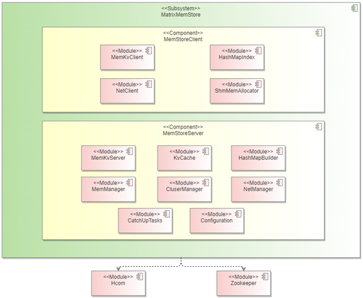

**表 1**  逻辑元素

|模块名|模块描述|
|--|--|
|MemStoreClient|轻量级客户端，以so的形式集成到业务进程中。|
|MemKvClient|对上层业务提供KV语义相关的API接口。|
|HashMapIndex|只读共享内存索引管理，加速KV GET操作。|
|ShmMemAllocator|KV操作中KV数据内容和控制上下文分离，减少通信拷贝对IO时延的影响。|
|NetClient|维护客户端同本地内存管理进程的IPC通信链路，负责IPC消息通信。|
|MemStoreServer|内存管理进程，负责集群内全副本数据一致性维护。|
|MemKvServer|对客户端提供KV语义相关的交互，负责集群内多副本分发。|
|KvCache|本地副本的KV记录缓存管理。|
|HashMapBuilder|只读共享内存索引管理构造器。|
|MemManager|内存管理，将管理内存按照不同用途类型进行划分。|
|ClusterManager|集群管理，维护节点视图和分区视图（数据一致性视图）。|
|NetManager|维护不同节点的内存管理进程之间的RPC通信链路，负责RPC消息通信。|
|CatchUpTasks|针对故障待恢复节点，基于分区视图生成细粒度多并发数据追赶任务。|
|Hcom|自研底层通信库，提供可靠的IPC和RPC通信，支持多种通信协议类型。|
|Zookeeper|开源三方，作为集群管理的视图持久化承载体，以及节点心跳监控。|

## 关键技术

- **[内存管理技术方案](#内存管理技术方案)**  

- **[集群管理技术方案](#集群管理技术方案)**  

- **[通信管理技术方案](#通信管理技术方案)**  

### 内存管理技术方案

随着制程工艺的发展，芯片上晶体管的密度越来越高，功耗墙的存在迫使CPU从单核走向多核。在SMP系统中，核数的扩展受到内存总线的限制。非统一内存访问架构（Non-uniform memory access，NUMA）很好的解决了这一问题。

鲲鹏处理器支持NUMA架构。在NUMA架构下，整个内存空间在物理上是分布式的，不同的核访问不同内存的时间不同，因此有了Node和Distance的概念。以Core0为例，访问1时延<访问2时延<访问3时延<访问4时延（距离依次变远）。

**图 1**  NUMA架构  
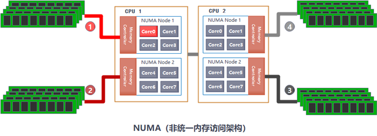

为了保障IO的极致低时延，整个IO路径上要确保资源满足亲和性原则，包含CPU、内存、网卡资源，IO路径包含：用户业务上下文、内存客户端、内存服务端、网络消息，以下图为例。

**图 2**  IO路径亲和性调度  
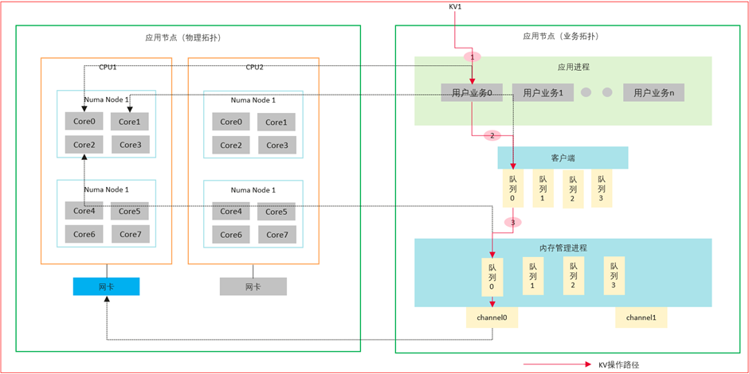

1. 空间划分

    内存数据管理通过配置文件解析，获取每个Numa Node上的管理内存，内存空间划分为KV INDEX、IOCTX Allocator、KV Allocator三个部分，区域划分方式如下：

    **图 2**  内存空间划分  
    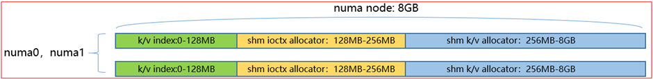

2. 索引管理

    为了实现索引管理跨进程间共享访问，提一步升KV GET性能，当前阶段，简化索引管理实现，当前索引管理采用HashTable方式，支撑快速索引查找；索引内存空间，主要维护bucket数组，每个bucket包含sharelock、index node（valid、next hashcode、next kv addr）等基本信息， KV数据记录包含index node、KEY、VALUE等基本信息，以插入KV操作为例，基于KEY计算hashcode，通过hashcode % bucket num获取bucket index，基于index node遍历冲突链，通过hashcode+KEY检查是否存在写入冲突，插入KV数据记录；为了减少hash冲突，可以适当预留较大的索引内存空间。

    **图 3**  HashTable索引管理  
    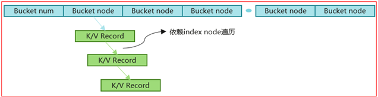

### 集群管理技术方案

集群管理负责在多个计算节点上协调、管理和监控资源、任务和服务的过程，以确保集群中所有节点的有效协作和高效运行。业务数据需要做全副本一致性保护，每个节点均要承接业务数据下发，业务运行过程中，需要处理各类故障场景；引入节点视图，负责节点健康状态监控；引入分区视图，将调度资源均匀打散到各个分区，具体用户业务归属具体分区，上层业务不感知分区的存在，分区负责数据副本一致性状态的维护。

1. 节点视图

    **图 1**  集群加入  
    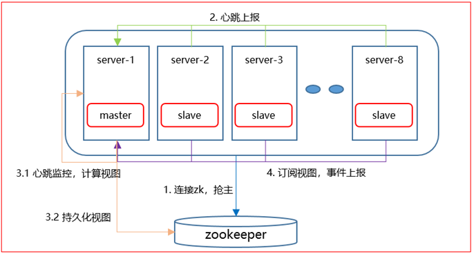

    **图 2**  节点视图  
    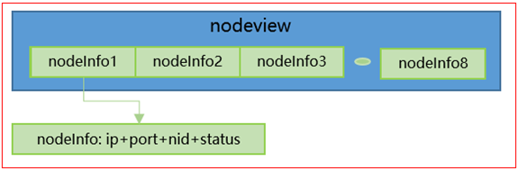

    节点视图：池内节点状态监控，处理节点的加入退出。

2. 分区视图

    **图 3**  资源按分区打散  
    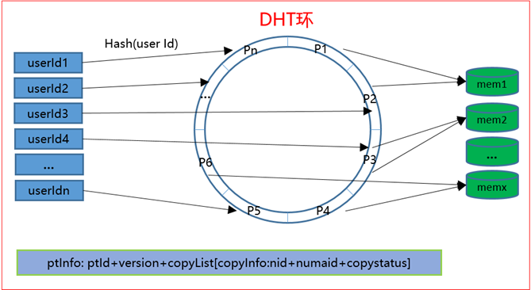

    分区视图：数据冗余保护，负责池内DHT环管理，每一段称为一个分区，负责部分数据管理。

    **图 4**  分区视图分布  
    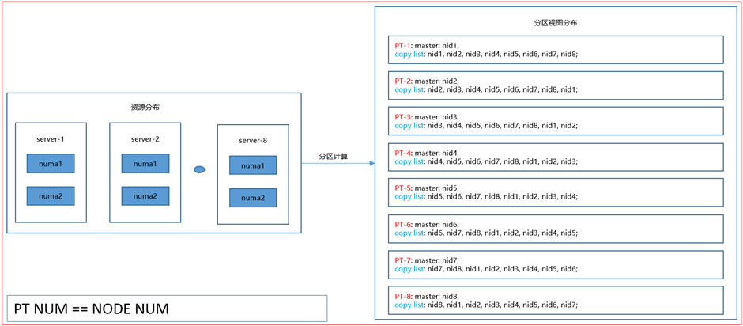

    简化分区视图管理，集群状态正常时，每个节点上的归属分区控制在1个，具体用户业务基于userId按照集群规模hash打散到其归属节点上，该节点上的归属分区会校验具体用户业务的归属是否匹配，数据同步按照分区粒度打散到各个节点上，并发执行。

### 通信管理技术方案

作为一个分布式系统，KV操作的高可靠低时延，强烈依赖通信网络的设计实现。分离部署形态下，链路管理分为节点内跨进程的SHM IPC和跨节点通信的RDMA RPC。节点内，业务进程中的客户端同内存管理进程之间建立SHM IPC链路；节点间，内存管理进程之间需要建立RDMA RPC链路。链路管理实现了链路建立、链路状态检测、链路故障重连、数据加密、流量控制、消息超时检测等基本的可靠性功能；同时为了提高通信传输效率，支持指定传输链路上的消息处理调度上下文绑核，支持灵活选取BusyPoll模式或者EventPoll模式的消息处理模式。

**图 1**  链路分布  
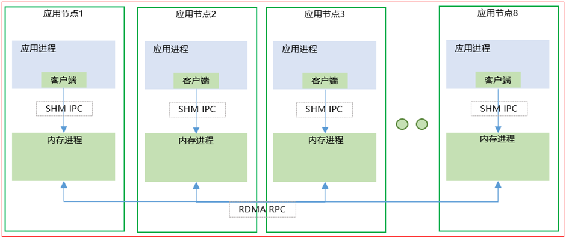

通信组件对使用方提供同步消息接口（SyncCall）和异步消息接口（AsyncCall）两种方式；为了减少上下文切换次数，客户端到内存数据管理服务端的SHM IPC采用同步消息接口；内存数据管理服务端需要进行多副本节点消息分发，然后等待各个节点REPLY响应，只能采用异步消息接口。当前的通信能力模型为P2P模式的点对点通信，一次功能完备的点对点通信，涉及的通信路径较长，对于集群内多节点范围的软件组播性能产生巨大挑战，如下图。

**图 2**  软件组播分发  
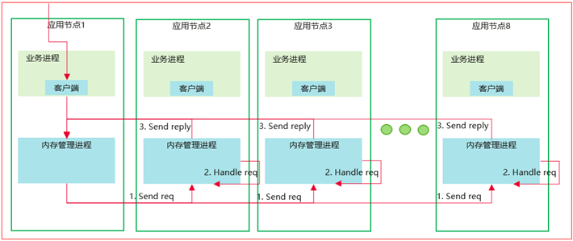

软件组播实现，性能优化设计，下沉副本分发逻辑至verbs层，组播和聚播功能在verbs层实现闭环，打薄整体软件栈厚度，将软件组播方案性能做到极致。优化策略分为两步：1）Link Join；2）Message Dispatch，Link Join为控制指令，等同组播群组加入的动作，集群状态稳定时，仅需执行一次；组播发送时，在verbs层，遍历queue pair，执行组播和聚播操作。

**图 3**  Link Join + Message Dispatch  
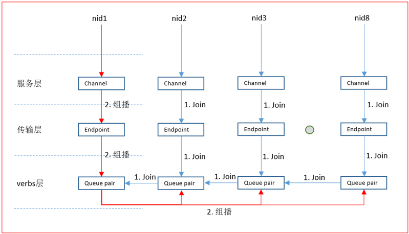

**图 4**  单并发组播时延对比  
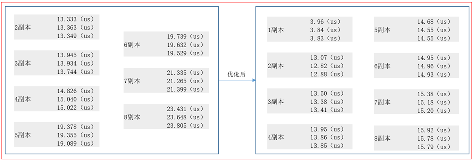

## 部署方式

**图 1**  进程部署形态  

## 约束限制

- **[业务组网](#业务组网)** 
- **[测试方法](#测试方法)** 
- **[性能指标](#性能指标)** 
- **[资源约束](#资源约束)** 
- **[其它约束](#其它约束)**  

### 业务组网

**图 1**  8台服务器互联集群  
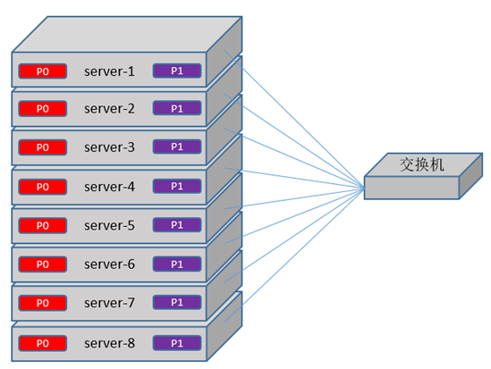

**图 2**  进程部署形态  
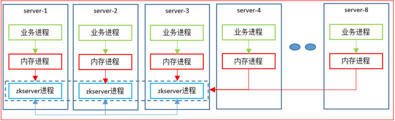

1. 硬件配置：服务器KUNPENG 920（7260（64cores, 主频2.6GHz）\*2；内存512GB；NVME SSD 7.68TB\*12；MLX CX5 RDMA网卡 100Gbps；光模块/线100Gbps）\*8；交换机（CloudEngine 8800 系列）\*1。
2. 操作系统：openEuler 22.03 LTS SP2。
3. 三方依赖：zookeeper 3.8.1；ofed驱动 MLNX\_OFED\_LINUX-5.8-5.1.1.2。

### 测试方法

1. 自研测试工具，支持KV纯读、纯写、读写混合、单并发、多并发等测试模型。
2. 对接业务，端到端POC测试。

### 性能指标

1. 单节点7:3混合读写，IOPS 20w@2KB。
2. 软件组播实现方式：全副本强同步写，单并发写IO平均时延<=20us@2KB。
3. 硬件组播实现方式：全副本强同步写，多并发写IO平均时延<=20us@2KB。

### 资源约束

每台物理服务上提供给内存管理服务的内存资源、CPU资源、网卡资源，满足镜像对等匹配，以下图为例；同时确保内存、CPU、网卡在物理拓扑上满足亲和性，保障IO的极致低时延。

**图 1**  对等资源预留  
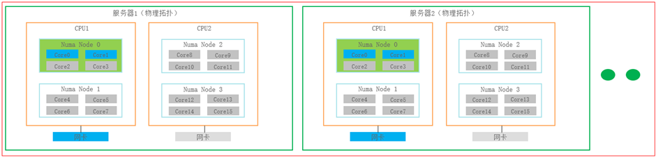

为了满足KV操作极致低时延的诉求，内存数据管理需要独占一些CPU核，进行绑定，IO通信调度采用BUSY POLLING方式，通信服务资源包括IPC和RPC两类，另外，后台任务调度需要额外预留少量CPU核，内存空间划分为IOCTX、INDEX、K/V数据三类，单节点上，最小资源预留规格：单NumaNode上，内存8GB，CPU 8核（IPC:2核+RPC:4核+CATCHUP TASK:2核），备注（不包含通信预留的少量内存资源）。

### 其它约束

内存数据管理当前仅支持内存存储介质类型，另外，组播方案当前均基于RDMA网卡的verbs层逻辑进行适配修改，如果采用硬件组播实现方案，还需依赖特定的DPU卡或者交换机类型。

## 故障处理

在故障待恢复节点上，由上层应用控制启动本节点的后台数据同步任务；后台数据同步任务调度会从其他正常节点按照分区粒度同步数据；针对具体分区同步数据的过程中，要做好前后台IO的互斥和数据追赶逻辑的设计，这里重点对这两点的设计实现进行补充说明。

可服务节点准备向待恢复节点同步数据时，在前台IO路径上注册悬挂互斥函数；前台IO获取关联分区对象后，通过悬挂互斥函数维护的PT SYNC MAP表，来保证对同一KEY操作的串行化处理，同时决定是否向待恢复节点做副本分发操作。

**图 1**  前后台IO互斥  
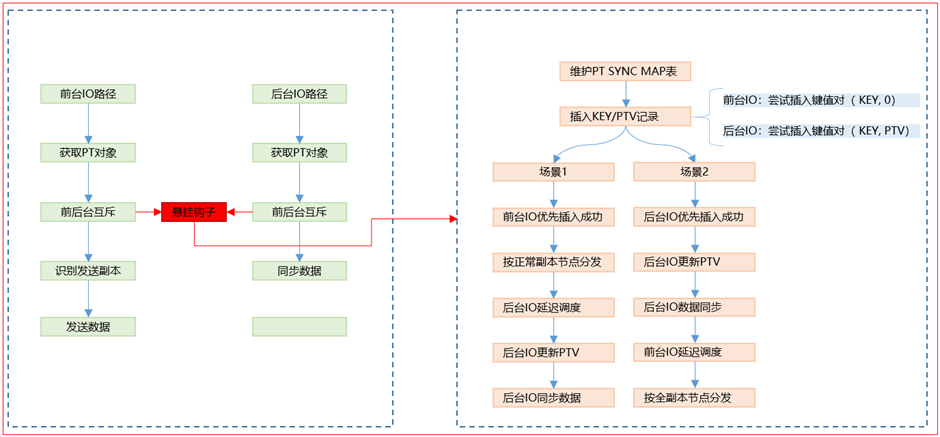

阶段一，后台IO优先同步Cache缓存的KV数据，完成初始数据同步，同步过程中新产生的KV数据会记录到PT SYNC MAP中；阶段二，后台IO同步PT SYNC MAP中新增的KV数据，同步过程中不进行PT粒度的悬挂，可能会产生新增的KV数据；阶段三，通过剩余数据量+最大同步次数控制阶段二的执行时间，进行PT粒度的悬挂，将剩余的KV数据同步到待恢复节点；完成分区粒度的整个数据同步过程。

**图 2**  同步数据来源  

